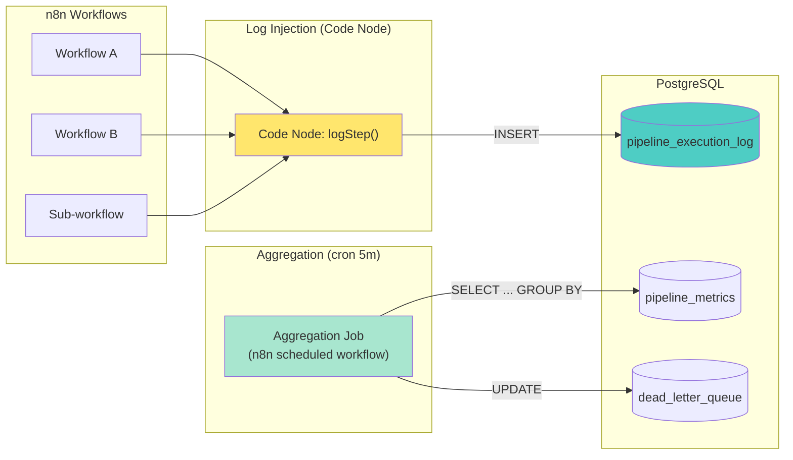

# ADR-002: Архитектура логирования, мониторинга и отказоустойчивости для n8n Translation Pipeline

**Статус:** Proposed
**Дата:** 2026-04-10
**Контекст:** 55 workflows (33 active), LightRAG :9621, Ollama :11434, PostgreSQL 16, Grafana 11.5, Prometheus. Требуется observability + resilience без влияния на качество перевода.

---

## 1. Схема новых таблиц БД

### 1.1. `pipeline_execution_log` — детальное логирование каждой ноды

```sql
CREATE TABLE pipeline_execution_log (
    id              BIGSERIAL PRIMARY KEY,
    execution_id    UUID NOT NULL,                -- n8n execution ID
    workflow_id     INTEGER REFERENCES workflow_entity(id),
    workflow_name   VARCHAR(200),
    node_id         VARCHAR(100),                 -- n8n node UUID
    node_name       VARCHAR(200),
    node_type       VARCHAR(100),                 -- httpRequest, code, postgres, etc.
    step_order      INTEGER,                      -- порядок выполнения в pipeline

    -- Входные данные
    input_summary   JSONB,                        -- ключевые поля входных данных (не полный payload)
    input_bytes     INTEGER,                      -- размер входных данных

    -- Выходные данные
    output_summary  JSONB,                        -- ключевые поля выходных данных
    output_bytes    INTEGER,
    output_items    INTEGER,                      -- количество items на выходе

    -- Метрики
    status          VARCHAR(20) NOT NULL,          -- success, error, skipped
    duration_ms     INTEGER,                      -- время выполнения ноды
    started_at      TIMESTAMPTZ NOT NULL DEFAULT NOW(),
    completed_at    TIMESTAMPTZ,

    -- Ошибки
    error_type      VARCHAR(100),                 -- ECONNREFUSED, ETIMEDOUT, TypeError, etc.
    error_message   TEXT,
    retry_count     INTEGER DEFAULT 0,

    -- Метаданные
    metadata        JSONB DEFAULT '{}'::jsonb,    -- model, endpoint, chapter_id, job_id и т.д.
    created_at      TIMESTAMPTZ NOT NULL DEFAULT NOW()
);

-- Индексы
CREATE INDEX idx_pipel_exec_workflow ON pipeline_execution_log(workflow_id, started_at DESC);
CREATE INDEX idx_pipel_exec_node     ON pipeline_execution_log(node_name, started_at DESC);
CREATE INDEX idx_pipel_exec_status   ON pipeline_execution_log(status, started_at DESC);
CREATE INDEX idx_pipel_exec_error    ON pipeline_execution_log(error_type, started_at DESC)
    WHERE status = 'error';
CREATE INDEX idx_pipel_exec_job      ON pipeline_execution_log((metadata->>'job_id'))
    WHERE metadata ? 'job_id';
CREATE INDEX idx_pipel_exec_duration ON pipeline_execution_log(duration_ms DESC);
```

### 1.2. `pipeline_metrics` — агрегированные метрики (записываются раз в 5 минут)

```sql
CREATE TABLE pipeline_metrics (
    id              BIGSERIAL PRIMARY KEY,
    window_start    TIMESTAMPTZ NOT NULL,
    window_end      TIMESTAMPTZ NOT NULL,

    -- Объём
    total_executions    INTEGER DEFAULT 0,
    successful_executions INTEGER DEFAULT 0,
    failed_executions   INTEGER DEFAULT 0,
    total_nodes_executed INTEGER DEFAULT 0,

    -- Latency
    p50_latency_ms      INTEGER,
    p95_latency_ms      INTEGER,
    p99_latency_ms      INTEGER,
    avg_latency_ms      NUMERIC(10,2),
    max_latency_ms      INTEGER,

    -- Throughput
    executions_per_min  NUMERIC(8,2),
    nodes_per_min       NUMERIC(8,2),

    -- External API
    ollama_calls        INTEGER DEFAULT 0,
    ollama_errors       INTEGER DEFAULT 0,
    ollama_avg_ms       NUMERIC(10,2),
    lightrag_calls      INTEGER DEFAULT 0,
    lightrag_errors     INTEGER DEFAULT 0,
    lightrag_avg_ms     NUMERIC(10,2),

    -- Business
    chapters_translated INTEGER DEFAULT 0,
    words_translated    INTEGER DEFAULT 0,
    avg_quality_score   NUMERIC(4,2),

    created_at          TIMESTAMPTZ NOT NULL DEFAULT NOW(),

    UNIQUE(window_start)
);

CREATE INDEX idx_pipel_metrics_window ON pipeline_metrics(window_start DESC);
```

### 1.3. `circuit_breaker_state` — состояние circuit breaker для внешних API

```sql
CREATE TABLE circuit_breaker_state (
    id              SERIAL PRIMARY KEY,
    service_name    VARCHAR(50) NOT NULL,           -- ollama, lightrag, telegram_api
    state           VARCHAR(20) NOT NULL DEFAULT 'closed',  -- closed, open, half_open
    failure_count   INTEGER DEFAULT 0,
    success_count   INTEGER DEFAULT 0,
    last_failure_at TIMESTAMPTZ,
    last_success_at TIMESTAMPTZ,
    opened_at       TIMESTAMPTZ,                    -- когда circuit открыт
    half_open_at    TIMESTAMPTZ,                    -- когда начал проверку
    failure_threshold INTEGER DEFAULT 5,
    recovery_timeout_sec INTEGER DEFAULT 60,
    half_open_max_calls INTEGER DEFAULT 1,
    updated_at      TIMESTAMPTZ NOT NULL DEFAULT NOW(),

    UNIQUE(service_name)
);

-- Начальные записи
INSERT INTO circuit_breaker_state (service_name, failure_threshold, recovery_timeout_sec)
VALUES
    ('ollama', 5, 60),
    ('lightrag', 3, 30),
    ('telegram_api', 3, 120)
ON CONFLICT (service_name) DO NOTHING;
```

### 1.4. `dead_letter_queue` — необработанные сообщения/задачи

```sql
CREATE TABLE dead_letter_queue (
    id              BIGSERIAL PRIMARY KEY,
    source_table    VARCHAR(100) NOT NULL,          -- откуда задача
    source_id       INTEGER,                        -- ID оригинальной записи
    workflow_id     INTEGER,
    payload         JSONB NOT NULL,                 -- полный контекст задачи
    error_type      VARCHAR(100),
    error_message   TEXT,
    retry_count     INTEGER DEFAULT 0,
    max_retries     INTEGER DEFAULT 3,
    status          VARCHAR(20) DEFAULT 'pending',  -- pending, retrying, resolved, discarded
    next_retry_at   TIMESTAMPTZ,
    resolved_at     TIMESTAMPTZ,
    resolved_by     VARCHAR(100),                   -- manual или auto
    resolution_note TEXT,
    created_at      TIMESTAMPTZ NOT NULL DEFAULT NOW(),
    updated_at      TIMESTAMPTZ NOT NULL DEFAULT NOW()
);

CREATE INDEX idx_dlq_status ON dead_letter_queue(status, next_retry_at);
CREATE INDEX idx_dlq_created ON dead_letter_queue(created_at DESC);
```

### 1.5. `health_check_log` — результаты health checks

```sql
CREATE TABLE health_check_log (
    id              BIGSERIAL PRIMARY KEY,
    service_name    VARCHAR(50) NOT NULL,           -- ollama, lightrag, postgres, n8n, telegram
    status          VARCHAR(20) NOT NULL,           -- healthy, degraded, unhealthy
    response_time_ms INTEGER,
    details         JSONB DEFAULT '{}'::jsonb,      -- версия модели, размер БД, etc.
    checked_at      TIMESTAMPTZ NOT NULL DEFAULT NOW()
);

CREATE INDEX idx_health_service ON health_check_log(service_name, checked_at DESC);
```

---

## 2. Архитектура логирования

### 2.1. Сбор данных



### 2.2. Паттерн логирования в каждом workflow

Каждый workflow начинает и заканчивает логированием через **Code Node**. Функция `logStep` вызывается:
- **До** выполнения ноды: записывает `input_summary`, `started_at`
- **После** выполнения ноды: обновляет `output_summary`, `duration_ms`, `status`

**Code Node шаблон (JavaScript)** — добавляется в начало и конец каждого workflow:

```javascript
// === НАЧАЛО WORKFLOW: logStart ===
const execId = $('Trigger').first().json.executionId || crypto.randomUUID();
const wfName = $('Trigger').first().json.workflowName;

async function logStep(nodeName, nodeType, status, inputSummary, outputSummary, durationMs, errorType, errorMsg, metadata) {
  const query = `
    INSERT INTO pipeline_execution_log (
      execution_id, workflow_name, node_name, node_type, step_order,
      input_summary, output_summary, status, duration_ms,
      error_type, error_message, metadata
    ) VALUES ($1, $2, $3, $4, $5, $6, $7, $8, $9, $10, $11, $12)
  `;
  // Через n8n Postgres Node:
  // operation: executeQuery, query: query, params: [...]
  return { execId, logged: true };
}
```

**После каждой важной ноды** (Ollama API call, LightRAG query, DB write):
- Code Node вызывает `logStep()` с метриками из `input()` и `output()`
- Для HTTP-нод: записывает `method`, `url`, `status_code`, `response_time_ms` в `metadata`

### 2.3. Что НЕ логируем

- Полный текст документов (только `word_count`, `chunk_count`)
- API ключи и токены
- Полные request/response payload (только `summary` — первые 200 символов)
- Данные пользователей (имена, email)

### 2.4. Агрегация метрик

**Scheduled workflow** (каждые 5 минут):
```sql
INSERT INTO pipeline_metrics (
  window_start, window_end,
  total_executions, successful_executions, failed_executions,
  total_nodes_executed,
  p50_latency_ms, p95_latency_ms, p99_latency_ms, avg_latency_ms, max_latency_ms,
  executions_per_min, nodes_per_min,
  ollama_calls, ollama_errors, ollama_avg_ms,
  lightrag_calls, lightrag_errors, lightrag_avg_ms,
  chapters_translated, words_translated, avg_quality_score
)
SELECT
  $__timeFrom() as window_start,
  NOW() as window_end,
  COUNT(*) as total_executions,
  COUNT(*) FILTER (WHERE status = 'success') as successful_executions,
  COUNT(*) FILTER (WHERE status = 'error') as failed_executions,
  COUNT(DISTINCT node_id) as total_nodes_executed,
  PERCENTILE_CONT(0.5) WITHIN GROUP (ORDER BY duration_ms)::INTEGER as p50_latency_ms,
  PERCENTILE_CONT(0.95) WITHIN GROUP (ORDER BY duration_ms)::INTEGER as p95_latency_ms,
  PERCENTILE_CONT(0.99) WITHIN GROUP (ORDER BY duration_ms)::INTEGER as p99_latency_ms,
  ROUND(AVG(duration_ms), 2) as avg_latency_ms,
  MAX(duration_ms)::INTEGER as max_latency_ms,
  ROUND(COUNT(*) / 5.0, 2) as executions_per_min,
  ROUND(COUNT(DISTINCT node_id) / 5.0, 2) as nodes_per_min,
  COUNT(*) FILTER (WHERE metadata->>'service' = 'ollama') as ollama_calls,
  COUNT(*) FILTER (WHERE metadata->>'service' = 'ollama' AND status = 'error') as ollama_errors,
  ROUND(AVG(duration_ms) FILTER (WHERE metadata->>'service' = 'ollama'), 2) as ollama_avg_ms,
  COUNT(*) FILTER (WHERE metadata->>'service' = 'lightrag') as lightrag_calls,
  COUNT(*) FILTER (WHERE metadata->>'service' = 'lightrag' AND status = 'error') as lightrag_errors,
  ROUND(AVG(duration_ms) FILTER (WHERE metadata->>'service' = 'lightrag'), 2) as lightrag_avg_ms,
  0, 0, NULL  -- заполняется из document_chunks
FROM pipeline_execution_log
WHERE started_at >= NOW() - INTERVAL '5 minutes'
ON CONFLICT (window_start) DO UPDATE SET
  total_executions = EXCLUDED.total_executions,
  successful_executions = EXCLUDED.successful_executions,
  failed_executions = EXCLUDED.failed_executions,
  -- ... остальные поля
;
```

---

## 3. Grafana Dashboard план

### 3.1. Dashboard: "Translation Pipeline — Observability"

**Datasource:** PostgreSQL (postgres-n8n) + Prometheus

#### Row 1: Overview (Stat panels)

| Панель | SQL Query | Threshold |
|--------|-----------|-----------|
| Success Rate | `SELECT ROUND(100.0 * COUNT(*) FILTER (WHERE status='success') / NULLIF(COUNT(*),0), 1) FROM pipeline_execution_log WHERE started_at >= $__timeFrom()` | Green >= 95, Yellow >= 85, Red < 85 |
| Avg Latency | `SELECT ROUND(AVG(duration_ms), 0) FROM pipeline_execution_log WHERE started_at >= $__timeFrom() AND status='success'` | Green < 5000, Yellow < 15000, Red >= 15000 |
| Active Jobs | `SELECT COUNT(DISTINCT metadata->>'job_id') FROM pipeline_execution_log WHERE status='success' AND started_at >= NOW() - INTERVAL '1h'` | — |
| DLQ Pending | `SELECT COUNT(*) FROM dead_letter_queue WHERE status='pending'` | Red > 0 |

#### Row 2: Execution Flow (Mermaid-style arrows + animation)

| Панель | Тип | Query |
|--------|-----|-------|
| **Pipeline Flow Map** | Canvas / State Timeline | Для визуализации потока: каждая нода = узел, стрелки = переходы. Использовать `node_name` как label, цвет по `status`, толщина по `COUNT(*)` |
| **Node Execution Timeline** | State Timeline | `SELECT node_name as metric, started_at as time, completed_at as end_time, status FROM pipeline_execution_log WHERE execution_id = '$execution_id' ORDER BY step_order` |
| **Latency Heatmap** | Heatmap | `SELECT $__timeGroupAlias(started_at, '5m'), node_name, AVG(duration_ms) FROM pipeline_execution_log GROUP BY 1, 2` |

**Анимация потока:** Canvas panel с SVG стрелками:
- Данные из `pipeline_execution_log` → Flowchart через Canvas panel
- Стрелки: зелёные (success), красные (error), жёлтые (retry)
- Анимация через `valueMappings` + thresholds: пульсация при error rate > 10%

#### Row 3: Performance (Time Series)

| Панель | Query |
|--------|-------|
| **Latency P50/P95/P99** | `SELECT $__timeGroupAlias(started_at, '5m'), 'p50' as metric, PERCENTILE_CONT(0.5) WITHIN GROUP (ORDER BY duration_ms) FROM pipeline_execution_log WHERE started_at >= $__timeFrom() GROUP BY 1 UNION ALL SELECT $__timeGroupAlias(started_at, '5m'), 'p95', PERCENTILE_CONT(0.95) ... UNION ALL ... 'p99' ...` |
| **Throughput (exec/min)** | `SELECT $__timeGroupAlias(started_at, '1m'), COUNT(*) FROM pipeline_execution_log GROUP BY 1` |
| **Ollama vs LightRAG Latency** | `SELECT $__timeGroupAlias(started_at, '5m'), metadata->>'service' as service, AVG(duration_ms) FROM pipeline_execution_log WHERE metadata ? 'service' GROUP BY 1, 2` |

#### Row 4: Errors & Retries

| Панель | Query |
|--------|-------|
| **Error Rate by Workflow** | `SELECT workflow_name, COUNT(*) as errors FROM pipeline_execution_log WHERE status='error' AND started_at >= $__timeFrom() GROUP BY workflow_name ORDER BY errors DESC LIMIT 10` |
| **Error Distribution** | `SELECT error_type, COUNT(*) FROM pipeline_execution_log WHERE status='error' AND started_at >= $__timeFrom() GROUP BY error_type ORDER BY COUNT(*) DESC` |
| **Recent Errors Table** | `SELECT workflow_name, node_name, error_type, error_message, started_at FROM pipeline_execution_log WHERE status='error' ORDER BY started_at DESC LIMIT 25` |
| **Dead Letter Queue** | `SELECT source_table, error_type, retry_count, next_retry_at, created_at FROM dead_letter_queue WHERE status='pending' ORDER BY created_at DESC` |

#### Row 5: Health & Circuit Breaker

| Панель | Query |
|--------|-------|
| **Circuit Breaker Status** | `SELECT service_name, state, failure_count, last_failure_at FROM circuit_breaker_state` |
| **Service Health** | `SELECT service_name, status, response_time_ms, checked_at FROM health_check_log WHERE checked_at >= NOW() - INTERVAL '1h' ORDER BY checked_at DESC` |
| **Ollama Models Status** | Через Prometheus: `ollama_model_info` (если доступен), или SQL: `SELECT details->>'model' as model, details->>'size' as size FROM health_check_log WHERE service_name='ollama' ORDER BY checked_at DESC LIMIT 1` |

### 3.2. Dashboard Variables

| Переменная | Query | Тип |
|-----------|-------|-----|
| `$workflow_id` | `SELECT id, name FROM workflow_entity ORDER BY name` | Dropdown (multi) |
| `$execution_id` | `SELECT execution_id, workflow_name FROM pipeline_execution_log WHERE started_at >= $__timeFrom() ORDER BY started_at DESC LIMIT 100` | Dropdown |
| `$node_name` | `SELECT DISTINCT node_name FROM pipeline_execution_log ORDER BY node_name` | Dropdown (multi) |
| `$status` | `SELECT 'success', 'success' UNION ALL SELECT 'error', 'error' UNION ALL SELECT 'skipped', 'skipped'` | Dropdown |
| `$job_id` | `SELECT DISTINCT metadata->>'job_id' FROM pipeline_execution_log WHERE metadata ? 'job_id' ORDER BY 1 DESC` | Dropdown |

---

## 4. Alerting план

### 4.1. Alert rules (Grafana Alerting → Telegram webhook)

| Rule | Condition | Severity | Action |
|------|-----------|----------|--------|
| **Pipeline Error Rate > 15%** | `SUM(errors) / SUM(total) > 0.15` за 5 мин | Critical | Telegram + auto-pause новых jobs |
| **Ollama API Down** | 5 consecutive errors за 2 мин | Critical | Telegram + circuit breaker open |
| **LightRAG API Down** | 3 consecutive errors за 1 мин | Critical | Telegram + circuit breaker open |
| **DLQ Size > 10** | `COUNT(*) > 10` в dead_letter_queue | Warning | Telegram notification |
| **Avg Latency > 30s** | `AVG(duration_ms) > 30000` за 10 мин | Warning | Telegram — возможно, нагрузка на GPU |
| **Circuit Breaker Opened** | `state = 'open'` для любого сервиса | Warning | Telegram + логи |
| **PostgreSQL Connections > 80%** | `pg_stat_activity.count / max_connections > 0.8` | Critical | Telegram + investigation |
| **Disk Usage > 85%** | Node exporter: `node_filesystem_avail_bytes` | Warning | Telegram + cleanup plan |
| **Ollama Model Unloaded** | Health check: model не в памяти | Warning | Auto-reload модели |
| **No Executions for 30min** | `COUNT(*) = 0` за 30 мин (в рабочее время) | Info | Проверить триггеры |

### 4.2. Alert routing

```yaml
# Grafana Alerting Configuration
routes:
  - receiver: "telegram-critical"
    matchers:
      - severity = "critical"
    group_by: ["alertname", "service"]
    group_wait: 30s
    group_interval: 5m
    repeat_interval: 1h

  - receiver: "telegram-warning"
    matchers:
      - severity = "warning"
    group_by: ["alertname"]
    group_wait: 1m
    group_interval: 10m
    repeat_interval: 4h

  - receiver: "telegram-info"
    matchers:
      - severity = "info"
    group_by: ["alertname"]
    repeat_interval: 24h
```

**Telegram Alert Template:**
```
🚨 [{{ .Status | toUpper }}] {{ .CommonLabels.alertname }}

Service: {{ .CommonLabels.service }}
Severity: {{ .CommonLabels.severity }}

{{ range .Alerts }}
Value: {{ .Annotations.value }}
Summary: {{ .Annotations.summary }}
{{ end }}

Time: {{ .CommonAnnotations.timestamp }}
Dashboard: {{ .CommonAnnotations.dashboard_url }}
```

### 4.3. Health Check workflow (n8n scheduled, каждые 2 минуты)

```
Schedule Trigger (every 2m)
  → Split into 4 branches (parallel):
    ├─ Check Ollama:    GET http://localhost:11434/api/tags
    ├─ Check LightRAG:  GET http://localhost:9621/health
    ├─ Check PostgreSQL: SELECT 1
    └─ Check n8n:       GET http://localhost:5678/healthz
  → Each branch:
    ├─ Success → INSERT health_check_log (healthy, response_time_ms)
    └─ Failure → INSERT health_check_log (unhealthy, error), trigger alert
  → Update circuit_breaker_state based on results
```

---

## 5. Resilience план

### 5.1. Retry策略 (Exponential Backoff)

Настраивается **на каждой ноде** через n8n Settings:

| Нода | Max Retries | Backoff | Retry On |
|------|------------|---------|----------|
| Ollama HTTP Request | 3 | Exponential (10s, 30s, 90s) | Network error, 5xx, timeout |
| LightRAG HTTP Request | 3 | Exponential (5s, 15s, 45s) | Network error, 5xx |
| PostgreSQL Node | 2 | Fixed (5s) | Connection error |
| Telegram Node | 3 | Exponential (2s, 4s, 8s) | Rate limit (429), network |

**Не retry-им:**
- 400 Bad Request (invalid prompt)
- 401 Unauthorized (token issue)
- 403 Forbidden (permissions)
- Validation errors (данные, а не инфраструктура)

### 5.2. Circuit Breaker implementation

**Реализация через Code Node** перед каждым внешним API call:

```javascript
// === Circuit Breaker Check ===
// Вызывается ПЕРЕД каждым Ollama/LightRAG запросом

const serviceName = 'ollama'; // или 'lightrag'

const cbQuery = `
  SELECT state, failure_count, failure_threshold,
         recovery_timeout_sec, opened_at, half_open_at
  FROM circuit_breaker_state
  WHERE service_name = $1
`;

// Через Postgres Node получить состояние
const cb = result[0];

if (cb.state === 'open') {
  const elapsed = Date.now() - new Date(cb.opened_at).getTime();
  const timeout = cb.recovery_timeout_sec * 1000;

  if (elapsed < timeout) {
    // Circuit ещё открыт — fallback
    throw new Error(`Circuit breaker OPEN for ${serviceName}. Retry after ${Math.round((timeout - elapsed) / 1000)}s`);
  } else {
    // Переход в half_open — один тестовый запрос
    const updateQuery = `
      UPDATE circuit_breaker_state
      SET state = 'half_open', half_open_at = NOW(), updated_at = NOW()
      WHERE service_name = $1 AND state = 'open'
    `;
    // Execute update
  }
}

// Запрос разрешён (closed или half_open)
```

**После запроса — обновление состояния:**

```javascript
// === Circuit Breaker Update ===
// Вызывается ПОСЛЕ каждого запроса

if (requestSucceeded) {
  if (cb.state === 'half_open') {
    // Успешный тестовый запрос → closed
    UPDATE circuit_breaker_state
    SET state = 'closed', failure_count = 0,
        last_success_at = NOW(), updated_at = NOW()
    WHERE service_name = $1;
  } else {
    // Просто успех
    UPDATE circuit_breaker_state
    SET success_count = success_count + 1,
        last_success_at = NOW(), updated_at = NOW()
    WHERE service_name = $1;
  }
} else {
  UPDATE circuit_breaker_state
  SET failure_count = failure_count + 1,
      last_failure_at = NOW(),
      state = CASE WHEN failure_count + 1 >= failure_threshold
                   THEN 'open' ELSE state END,
      opened_at = CASE WHEN failure_count + 1 >= failure_threshold
                       THEN NOW() ELSE opened_at END,
      updated_at = NOW()
  WHERE service_name = $1;

  if (newFailureCount >= threshold) {
    // Trigger Telegram alert через Execute Workflow → Alert
    // Dead letter queue для ожидающих задач
  }
}
```

### 5.3. Dead Letter Queue обработка

**Попадание в DLQ:**
- Workflow error с retry_count >= max_retries
- Circuit breaker open > 5 минут
- Ошибка валидации данных (non-retryable)

**DLQ Processor workflow** (scheduled, каждые 5 минут):
```
Schedule Trigger (every 5m)
  → SELECT * FROM dead_letter_queue
    WHERE status = 'pending'
      AND (next_retry_at IS NULL OR next_retry_at <= NOW())
    ORDER BY created_at ASC
    LIMIT 10
  → For each item:
    ├─ Retry count < max_retries:
    │   ├─ Increment retry_count
    │   ├─ next_retry_at = NOW() + (2^retry_count * 30s)
    │   ├─ status = 'retrying'
    │   └─ Re-execute original workflow with payload
    └─ Retry count >= max_retries:
        └─ status = 'pending' (wait for manual review)
  → Telegram alert if DLQ.size > 10
```

**Manual resolution:**
- Через pgAdmin или n8n интерфейс
- `UPDATE dead_letter_queue SET status='resolved', resolved_at=NOW(), resolved_by='manual', resolution_note='...' WHERE id = X`

### 5.4. Auto-retry для document_chunks

**PostgreSQL function** для автоматического retry упавших chunks:

```sql
CREATE OR REPLACE FUNCTION retry_failed_chunks()
RETURNS TABLE(chunk_id INT, job_id INT) AS $$
BEGIN
  -- Чанки со статусом 'error' и retry_count < 3
  RETURN QUERY
  UPDATE document_chunks
  SET status = 'pending',
      retry_count = retry_count + 1,
      error_text = NULL,
      updated_at = NOW()
  WHERE status = 'error'
    AND retry_count < 3
    AND updated_at < NOW() - INTERVAL '5 minutes'
  RETURNING id, job_id;
END;
$$ LANGUAGE plpgsql;
```

Вызывается из **Health Check workflow** каждые 10 минут.

### 5.5. Graceful Degradation

| Сценарий | Degradation |
|----------|-------------|
| **LightRAG down** | Fallback к прямому переводу без RAG-контекста. Glossary подставляется из БД напрямую (SQL JOIN). Логирование: `metadata.fallback_mode = 'no_rag'` |
| **Ollama down** | Queue chapters в DLQ, circuit breaker open, alert. Когда Ollama поднимается — DLQ processor auto-resume |
| **PostgreSQL down** | n8n не может работать — critical alert, весь pipeline pause |
| **Telegram down** | Логирование в БД (без уведомлений), retry отправки каждые 5 мин |
| **GPU memory full** | Ollama выгружает модель — health check обнаруживает, auto-reload через `/api/pull` |

### 5.6. Checkpointing и Idempotency

**Правила:**
1. Каждый chunk записывается в БД **до** начала перевода (`status = 'translating'`)
2. Результат записывается **атомарно** (`translated_text`, `status = 'translated'`)
3. Workflow **resume** с `WHERE status IN ('pending', 'error')` — skipped completed
4. Telegram сообщения — idempotent через `message_id` (edit если существует, send если нет)

```sql
-- Resume query для workflow
SELECT * FROM document_chunks
WHERE job_id = $1
  AND status IN ('pending', 'error')
  AND (retry_count IS NULL OR retry_count < 3)
ORDER BY chunk_index
LIMIT $batch_size;
```

---

## 6. Миграция: поэтапное внедрение

### Phase 1 (Week 1): Tables + Basic Logging
```bash
# Создать таблицы
docker exec -i n8n-docker-db-1 psql -U n8n_user -d n8n_database < migrations/001_observability_schema.sql

# Добавить logStep() Code Node в 5 критичных workflow
```

### Phase 2 (Week 2): Grafana Dashboard + Alerts
```bash
# Импортировать dashboard
curl -X POST http://localhost:3000/api/dashboards/import \
  -H "Content-Type: application/json" \
  -d @grafana/dashboards/translation-pipeline-observability.json
```

### Phase 3 (Week 3): Circuit Breaker + DLQ
```bash
# Добавить Circuit Breaker Code Node перед Ollama/LightRAG вызовами
# Запустить DLQ Processor workflow
```

### Phase 4 (Week 4): Full Coverage
```bash
# Добавить логирование во все 33 active workflow
# Настроить health check workflow
# End-to-end test: kill Ollama → verify circuit breaker → verify DLQ → restart → verify recovery
```

---

## 7. Влияние на производительность

| Компонент | Overhead | Mitigation |
|-----------|----------|------------|
| `pipeline_execution_log` INSERT | ~5ms на запись (async через n8n queue) | Batch INSERT раз в 30 сек |
| Агрегация метрик (5m) | ~200ms | Индексы + materialized view |
| Health check (2m) | ~50ms total | Parallel branches |
| Circuit breaker check | ~2ms | In-memory cache (опционально) |
| **Итого** | **~7ms per node execution** | < 1% от total pipeline time |

**Рекомендация:** Включить `logStep()` только для критичных нод (API calls, DB writes) на первых этапах. Добавить для всех нод после Phase 4.

---

## 8. Файлы для создания

| Файл | Назначение |
|------|-----------|
| `/home/user/n8n-docker/migrations/001_observability_schema.sql` | Все CREATE TABLE + индексы |
| `/home/user/n8n-docker/grafana/dashboards/translation-pipeline-observability.json` | Grafana dashboard export |
| `/home/user/n8n-docker/prometheus/rules/alerts.yml` | Prometheus alerting rules |
| `/home/user/n8n-docker/workflows/health-check.json` | Health check workflow |
| `/home/user/n8n-docker/workflows/dlq-processor.json` | Dead Letter Queue processor workflow |
| `/home/user/n8n-docker/workflows/metrics-aggregator.json` | 5-min metrics aggregation workflow |

---

**Документация создана:** 10 апреля 2026 г.
**Автор:** Architect Agent
**Статус:** На утверждении
**Связанные:** ADR-001 (Translation Architecture), BOOK_TRANSLATION_ARCHITECTURE.md
