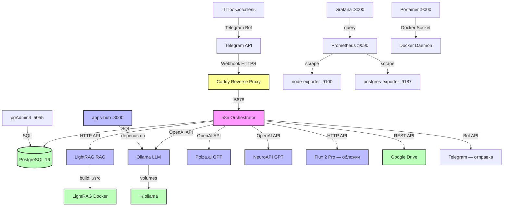
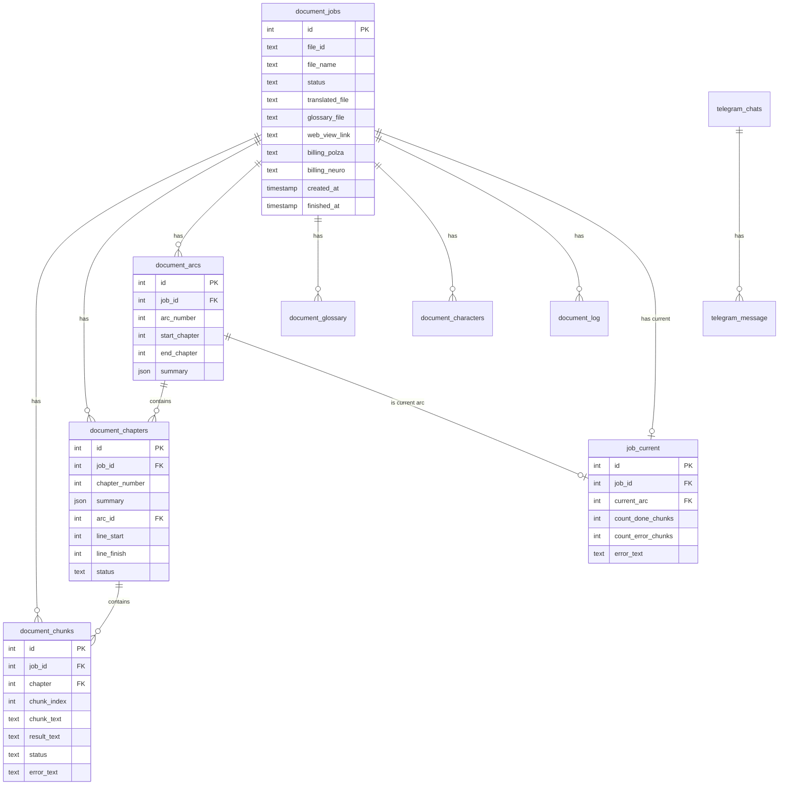

# n8n Translation System — Полная документация проекта

> Дата генерации: 11 апреля 2026 г.
> Версия: 1.0
> Путь проекта: `/home/user/n8n-docker/`

---

## Оглавление

1. [Обзор проекта](#1-обзор-проекта)
2. [Архитектура](#2-архитектура)
3. [Полная схема перевода](#3-полная-схема-перевода)
4. [Все Workflows](#4-все-workflows)
5. [Диаграмма связей workflows](#5-диаграмма-связей-workflows)
6. [База данных](#6-база-данных)
7. [Внешние API](#7-внешние-api)
8. [Инфраструктура](#8-инфраструктура)

---

## 1. Обзор проекта

### Назначение

Автоматизированная система перевода книг (корейские веб-новеллы) на русский язык. Система принимает DOCX/TXT файлы через Telegram, разбивает их на главы и чанки, переводит каждый чанк с помощью LLM (Ollama + OpenAI-совместимые API), сохраняет результат в БД, генерирует итоговый файл и отправляет пользователю через Telegram и Google Drive.

### Стек технологий

| Компонент | Технология |
|-----------|-----------|
| Orchestrator | n8n (latest, Docker) |
| База данных | PostgreSQL 16 (Alpine) |
| RAG | LightRAG (self-hosted) |
| LLM (local) | Ollama (local) |
| LLM (cloud) | GPT-4o-mini, GPT-5-mini, GPT-5.2, GPT-5.3 (Polza.ai, NeuroAPI) |
| Image Gen | Flux 2 Pro (polza.ai) |
| Reverse Proxy | Caddy |
| Monitoring | Prometheus + Grafana + node-exporter + postgres-exporter |
| Docker UI | Portainer |
| DB Admin | pgAdmin4 |
| Chat Bot | Telegram Bot API |
| Storage | Google Drive API |

### Статистика

- **Всего workflows:** 54 (33 активных, 21 заархивированных)
- **Активных рабочих workflows:** 19
- **Таблиц в БД:** 81
- **Docker-сервисов:** 11

### Домены

| Домен | Назначение |
|-------|-----------|
| `bigalexn8n.ru` | n8n web-интерфейс + webhook'и |
| `grafana.bigalexn8n.ru` | Grafana dashboard (basic auth) |
| `docker.bigalexn8n.ru` | Portainer |
| `ai.bigalexn8n.ru` | apps-hub (FastAPI) |
| `lightrag.bigalexn8n.ru` | LightRAG API |

---

## 2. Архитектура

### Mermaid-диаграмма всех компонентов



### Docker-сервисы (n8n-docker/docker-compose.yml)

| Сервис | Образ | Порты | Назначение |
|--------|-------|-------|-----------|
| `db` | postgres:16-alpine | 5432 | Основная БД n8n + данные проекта |
| `n8n` | n8nio/n8n:latest | host:5678 | Оркестратор workflows |
| `pgadmin` | dpage/pgadmin4:latest | 127.0.0.1:5055 | Администрирование БД |
| `node-exporter` | prom/node-exporter:latest | 9100 | Метрики хоста |
| `prometheus` | prom/prometheus:latest | 9090 | Сбор и хранение метрик |
| `postgres-exporter` | prometheuscommunity/postgres-exporter:latest | 9187 | Метрики PostgreSQL |

### Docker-сервисы (lightrag/docker-compose.yml)

| Сервис | Образ | Назначение |
|--------|-------|-----------|
| `ollama` | ollama/ollama:latest | Локальная LLM (перевод чанков) |
| `lightrag` | build: ./src | RAG система — граф знаний книги |
| `open-webui` | ghcr.io/open-webui/open-webui:main | UI для Ollama |
| `apps-hub` | build: /home/user/telegram-apps | FastAPI микросервис |
| `portainer` | portainer/portainer-ce:latest | Управление Docker |

---

## 3. Полная схема перевода

### Pipeline от файла до результата

```mermaid
flowchart LR
    A[Пользователь отправляет\nDOCX/TXT в Telegram] --> B[[GET] /select_files]
    B --> C{Тип файла?}
    C -->|DOCX| D[DOCX to Text]
    C -->|TXT| E[TXT to Text]
    C -->|XLSX| F[XLSX to Text]
    D --> G[Определение языка]
    E --> G
    F --> G
    G --> H[Сохранение файла в БД]
    H --> I[Парсинг файла → текст]
    I --> J[Предварительный анализ\nLightRAG Information Extractor]
    J --> K[Создание глав и чанков в БД]
    K --> L{Есть глоссарий?}
    L -->|Да| M[Парсинг глоссария → БД]
    L -->|Нет| N[Создание глоссария\nавтоматически]
    M --> O{Есть промт?}
    N --> O
    O -->|Да| P[Чтение промта из файла → БД]
    O -->|Нет| Q[Промт по умолчанию]
    P --> R[Настройка БД —\nсоздание job_current]
    Q --> R
    R --> S[[Start] — главный\nоркестратор]
    S --> T[[Translate Chunk]\nцикл перевода]
    T --> U[[Перевод чанка]\nLLM Agent + RAG]
    U --> V[[Перевод] Глава\nRolling Summary + Chapter Summary]
    V --> W[[Перевод] Арка\nArc boundary detection]
    W --> X{Все чанки\nпереведены?}
    X -->|Нет| T
    X -->|Да| Y[[Finish]\nОбновление статуса]
    Y --> Z1[Сохранение в Google Drive]
    Y --> Z2[Отправка в Telegram]
    Y --> Z3[Очистка binary data]
    Z1 --> END[✅ Готово]
    Z2 --> END
    Z3 --> END

    style T fill:#ff9
    style U fill:#bbf
    style V fill:#bbf
    style W fill:#bbf
```

### Пошаговое описание

1. **Загрузка файла** — пользователь отправляет DOCX/TXT файл боту в Telegram
2. **Выбор файлов** — workflow `[GET] /select_files` определяет тип файла, извлекает текст
3. **Предварительный анализ** — LightRAG Information Extractor определяет структуру: главы, персонажи, локации
4. **Разбиение** — текст разбивается на главы → чанки, сохраняется в БД
5. **Глоссарий** — пользователь может загрузить свой глоссарий или система создаёт автоматически
6. **Промт** — пользователь может загрузить кастомный промт для перевода
7. **Перевод чанков** — цикл: выбор чанка → перевод → сохранение → следующий чанк
8. **Обработка главы** — когда все чанки главы переведены: rolling summary + chapter summary
9. **Обработка арки** — определение границ арки, обновление arc summary
10. **Завершение** — сборка итогового файла, отправка в Google Drive + Telegram

---

## 4. Все Workflows

### 4.1 [GET] /select_files (`MmfiOXrCt2lkZ4TxZMyWS`) — 72 ноды

**Назначение:** Главный entry-point для загрузки файлов через Telegram. Обрабатывает входящие документы, определяет тип, извлекает текст и направляет на сохранение.

**Trigger:** Webhook (POST) — вызывается при получении документа в Telegram.

**Ноды (ключевые):**

| Нода | Тип | Описание |
|------|-----|----------|
| Get a file | Telegram | Скачивает файл из Telegram по file_id |
| Определяем тип файла | Code (JS) | Определяет формат по magic bytes: DOCX, TXT, XLSX и др. |
| Switch1 | Switch | Роутинг по типу файла: DOCX → docxToText, TXT → extract, XLSX → extract |
| DOCX to Text | docxToText | Конвертация DOCX в plain text |
| TXT to Text | extractFromFile | Извлечение текста из TXT |
| Code in JavaScript1 | Code (JS) | Определение языка текста (корейский/русский/английский) по Unicode диапазонам |
| Запись файла для перевода в БД | PostgreSQL | Сохраняет файл в `document_files` с binary данными |
| Глоссарий задан? | If | Проверяет, приложил ли пользователь глоссарий |
| Промт задан? | If | Проверяет, приложил ли пользователь промт |
| Промт для постредакта задан? | If | Проверяет промт для постредактуры |
| Select From List (×3) | ExecuteWorkflow | Интерактивный выбор: глоссарий, промт, пост-промт через inline-кнопки |
| Сообщение о создании задачи | PostgreSQL | Вставляет `INSERT INTO telegram_send_message (template) VALUES ('create_job')` |
| Старт перевода | ExecuteWorkflow → `rlk5lgq3uE4N0yl0` | Запускает добавление ресурсов в БД и старт перевода |

**Входящие данные:** Telegram message с document attachment.
**Исходящие данные:** Запись в `document_files`, запуск `rlk5lgq3uE4N0yl0`.

---

### 4.2 [GET] Document (`sLo74sUgMdcJEmxJoRJQ-`) — 14 нод

**Назначение:** Получение документа из Telegram, определение типа и извлечение текста.

**Trigger:** Execute Workflow Trigger (вызывается из `[GET] /select_files`).

**Ноды:**

| Нода | Тип | Описание |
|------|-----|----------|
| Get a file | Telegram | Скачивает файл из Telegram |
| Определяем тип файла | Code (JS) | Magic bytes анализ первых 16 байт + MIME type fallback |
| Switch1 | Switch | Роутинг: DOCX / TXT / XLSX |
| DOCX to Text | docxToText | Конвертация DOCX |
| TXT to Text | extractFromFile | Извлечение TXT |
| Merge | Merge | Объединение результатов |
| Code in JavaScript1 | Code (JS) | Детекция языка по символным диапазонам (korean, cyrillic, latin, japanese, chinese, arabic) |

**Входящие:** `message.document.file_id` из Telegram.
**Исходящие:** `{ type, category, language, languageName, confidence, text }`.

---

### 4.3 [Send] create_job (`ScNLD3LbRTVAJOK4`) — 8 нод

**Назначение:** Отправка уведомления в Telegram о создании задачи на перевод.

**Trigger:** Execute Workflow (`type: 'create'` или `type: 'delete'`).

**Ноды:**

| Нода | Тип | Описание |
|------|-----|----------|
| Start Workflow | ExecuteWorkflowTrigger | Вход: `type` (create/delete) |
| Get row(s) | DataTable | Чтение из `select_files` таблицы |
| TG | send | HTTP Request → Telegram sendMessage API |
| Опрос входящих | HTTP Request | Telegram getUpdates для проверки callback |
| Ожидаем? | If | Проверяет флаг `wait` |
| Добавим id сообщения в БД | PostgreSQL | Сохраняет message_id для последующего удаления |

**Входящие:** `{ type: 'create' | 'delete' }`.
**Исходящие:** Сообщение в Telegram «📋 Задача создана» с inline-кнопками.

---

### 4.4 [Send] processing (`9uUyj9OamISRPudJ`) — 13 нод

**Назначение:** Уведомление о прогрессе перевода (сколько чанков переведено).

**Trigger:** Execute Workflow.

**Ноды:**

| Нода | Тип | Описание |
|------|-----|----------|
| Start Workflow | ExecuteWorkflowTrigger | Без входных параметров |
| Get row(s) | DataTable | Чтение `select_files` |
| Текущий перевод | PostgreSQL | Запрос из `job_current` для получения прогресса |
| Сообщение о прогрессе | Code (JS) | Формирует текст: «📊 Прогресс: X / Y (Z%)» |
| Edit Message | Telegram | Редактирует существующее сообщение |

**Входящие:** Нет (читает из БД).
**Исходящие:** Обновлённое сообщение в Telegram с прогрессом.

---

### 4.5 [Send] wait (`OWLYY2oiQ6YPBJ7M`) — 10 нод

**Назначение:** Ожидание действия пользователя при ошибке. Показывает кнопку «Повторить» и ждёт callback.

**Trigger:** Execute Workflow.

**Ноды:**

| Нода | Тип | Описание |
|------|-----|----------|
| When Executed | ExecuteWorkflowTrigger | Вход: `qwerty` |
| Get row(s) | DataTable | Чтение `select_files` для chat_id |
| Сообщение Перевод остановлен | Code (JS) | Формирует сообщение с кнопкой «Повторить» |
| Send with Keyboard | Telegram | Inline-кнопка callback_data: `repeat_translate` |
| Опрос входящих | HTTP Request | getUpdates для проверки нажатия |
| Ожидаем? | If | Проверка флага `wait` |
| Определяем возможность продолжения | Code (JS) | Проверяет callback_data == 'repeat_translate' |
| Удаляем сообщение | Telegram | Delete message |
| Возобновление перевода | PostgreSQL | `UPDATE document_jobs SET status = 'resume'` |
| Ждем 1 сек | Wait | 1 секунда |

**Входящие:** `{ qwerty }` (пустой).
**Исходящие:** Интерактивное сообщение с ожиданием.

---

### 4.6 [Send] error (`2uhp8PCTjxiKj91n`) — 5 нод

**Назначение:** Уведомление об ошибке при переводе.

**Trigger:** Execute Workflow.

**Ноды:**

| Нода | Тип | Описание |
|------|-----|----------|
| Start Workflow | ExecuteWorkflowTrigger | Вход: пустой |
| Чтение error_text | PostgreSQL | Чтение из `job_current.error_text` |
| Формирование сообщения | Code (JS) | Формирует сообщение об ошибке |
| Отправка | Telegram | Send message |
| Логирование | PostgreSQL | Запись в `document_log` |

**Входящие:** Нет.
**Исходящие:** Сообщение «⚠️ Ошибка при переводе» в Telegram.

---

### 4.7 [Send] finish (`hoUl3ewz23AwAHlq`) — 19 нод

**Назначение:** Уведомление о завершении перевода. Обновляет статус job, отправляет файл.

**Trigger:** Execute Workflow (`job_id`).

**Ноды:**

| Нода | Тип | Описание |
|------|-----|----------|
| Start Workflow | ExecuteWorkflowTrigger | Вход: `job_id` |
| Сообщение о завершении перевода | PostgreSQL | `UPDATE document_jobs SET status='done', finished_at=NOW(), translated_file=..., web_view_link=...` |
| to log | PostgreSQL | Запись в `document_log` |
| Бинарные данные файлов | PostgreSQL | `UPDATE document_files SET translate_file=null, glossary=null, prompt=null` — очистка |
| Сообщение о завершении перевода1 | PostgreSQL | Альтернативный UPDATE (для non-Google Drive режима) |
| Ручной запуск перевода? | If | Проверка `source == 'custom'` |
| Переведенный файл в Telegram | ExecuteWorkflow → `sv73wrV6anQE7cTv` | Отправка файла ботом |
| Переведенный файл в Google Drive | ExecuteWorkflow → `KebWQcS1WmNtgdgA` | Загрузка в Google Drive |
| Сообщение о финише перевода | PostgreSQL | `INSERT INTO telegram_send_message (template) VALUES ('finish_processing')` |

**Входящие:** `{ job_id }`.
**Исходящие:** Обновлённый job, файл в Telegram/Drive.

---

### 4.8 Start (`9cjeUNeTZX3YnO1W57YTP`) — 21 нод

**Назначение:** Главный оркестратор запуска перевода. Получает файлы, настраивает глоссарий/промт, запускает цикл перевода.

**Trigger:** Execute Workflow Trigger.

**Входные параметры:**
- `translate_file` — файл для перевода
- `glossary_file` — файл глоссария (опционально)
- `book_prompt` — кастомный промт (опционально)
- `chat_id` — Telegram chat ID
- `glossary_make` — boolean, создавать ли глоссарий автоматически
- `post_production` — промт для постредактуры (опционально)

**Ноды:**

| Нода | Тип | Описание |
|------|-----|----------|
| Start Workflow | ExecuteWorkflowTrigger | 6 входных параметров |
| Настройка БД | ExecuteWorkflow → `UnqVdfxubclgfA7tafBwo` | Создание job, валидация, инициализация БД |
| Есть Глоссарий? | If | Проверка наличия `glossary_file` |
| Есть Промт? | If | Проверка наличия `book_prompt` |
| Есть Промт для постредакта? | If | Проверка наличия `post_production` |
| Добавление Глоссария | ExecuteWorkflow → `ZdsvkMfRDAU4yLbL3DPcK` | Парсинг и запись глоссария в БД |
| Добавление Промта | ExecuteWorkflow → `TVHpHR7HlCdrqEvAF3WNP` | Парсинг и запись промта в БД |
| Добавление Промта для постредакта | ExecuteWorkflow → `FuVQL0O5ik3aocbx` | Парсинг промта постредактуры |
| Без доп Промта | PostgreSQL | `UPDATE translate_prompts SET prompt = '' WHERE name like 'BP BL'` |
| Без доп Промта1 | PostgreSQL | `UPDATE translate_prompts SET prompt = '' WHERE name like 'PP Default'` |
| Создание Глоссария | ExecuteWorkflow → `t8Dmavjx9KS5Ms3SB3Qdj` | Автоматическое создание глоссария |
| Парсинг файла для перевода | ExecuteWorkflow → `bC43bgf5ZtXoi_XDLDwHO` | Извлечение текста из файла |
| Предварительный анализ файла | ExecuteWorkflow → `lSuNRX0VILP9Lgit5VKlK` | Анализ: главы, чанки, персонажи |
| Есть все данные для начала перевода? | If | Проверка: `translate_file != null && (glossary_file != null || glossary_make)` |
| Billing Polza.ai | HTTP Request | Запрос баланса Polza.ai |
| Billing Neuro | HTTP Request | Запрос баланса NeuroAPI |
| Сохраним данные от биллингов | PostgreSQL | Сохранение billing_neuro и billing_polza в `document_jobs` |
| Выполнить задачу по переводу текста | ExecuteWorkflow → `Q5TRHGg-XRblnMRpH41Ee` | Запуск цикла перевода |
| to log | PostgreSQL | Логирование старта |
| Merge1 | Merge (5 входов) | Объединение потоков |

**Входящие:** Объект с 6 полями.
**Исходящие:** Запуск `Translate Chunk` (Q5TRHGg-XRblnMRpH41Ee).

---

### 4.9 Translate Chunk (`Q5TRHGg-XRblnMRpH41Ee`) — 17 нод

**Назначение:** Циклический оркестратор перевода. Выбирает следующий чанк, запускает перевод, обновляет главы/арки, рекурсивно вызывает себя до завершения.

**Trigger:** Execute Workflow (`translate: 'start'` или без параметров для рекурсии).

**Ноды:**

| Нода | Тип | Описание |
|------|-----|----------|
| When Executed | ExecuteWorkflowTrigger | Вход: `translate` |
| Выбор чанка для перевода1 | PostgreSQL | `SELECT * FROM document_chunks WHERE job_id IN (SELECT job_id FROM job_current) AND result_text IS NULL ORDER BY chunk_index LIMIT 1` |
| Переведена вся книга? | If | Проверка: чанк пуст → всё переведено |
| Перевод чанка | ExecuteWorkflow → `GPARI8V4RBSPL1h39_kHW` | Перевод одного чанка (ждёт результат) |
| Чанк переведен успешно? | If | Проверка `status == 'done'` |
| Обновление Главы | ExecuteWorkflow → `IgLfaCSszdwsPw_b4u3au` | Rolling summary + chapter summary |
| Глава обновлена успешно? | If | Проверка `error == false` |
| Обновление Арки | ExecuteWorkflow → `OggkJgA8IFmasME_BNimq` | Arc boundary detection + rolling summary |
| Арка обновлена успешно? | If | Проверка `error == false` |
| Продолжение главы? | If | Проверка `is_new_chapter == false` |
| Оповещение о переводе очередной части | PostgreSQL | `INSERT INTO telegram_send_message (template) VALUES ('processing')` |
| Переход на следующий чанк | ExecuteWorkflow → `Q5TRHGg-XRblnMRpH41Ee` | **Рекурсия** — следующий чанк |
| Обновляем статус работы на Выполнено | PostgreSQL | `UPDATE document_jobs SET status = 'done' WHERE id IN (SELECT job_id FROM job_current)` |
| Финиш | ExecuteWorkflow → `vuqLp6ZGenvpkJbmVPR_6` | Завершение перевода |
| Обработка ошибки - Чанк | ExecuteWorkflow → `ImJpqAA5WlJZDK5jMtQSM` | Ошибка при переводе |
| Обработка ошибки - Глава | ExecuteWorkflow → `ImJpqAA5WlJZDK5jMtQSM` | Ошибка при обработке главы |
| Обработка ошибки - Арка | ExecuteWorkflow → `ImJpqAA5WlJZDK5jMtQSM` | Ошибка при обработке арки |

**Входящие:** `{ translate: 'start' }` или `{}` (рекурсия).
**Исходящие:** Рекурсивный цикл до завершения всех чанков → Finish.

---

### 4.10 [Перевод] Перевод чанка (`GPARI8V4RBSPL1h39_kHW`) — 34 ноды

**Назначение:** Непосредственный перевод одного чанка текста. Использует LLM Agent с RAG-контекстом из LightRAG.

**Trigger:** Execute Workflow (`id_chunk`).

**Ноды:**

| Нода | Тип | Описание |
|------|-----|----------|
| When Executed | ExecuteWorkflowTrigger | Вход: `id_chunk` |
| Переведенный чанк | PostgreSQL | `SELECT * FROM document_chunks WHERE id = $1` |
| Чтение глоссария | PostgreSQL | `SELECT * FROM document_glossary WHERE job_id = $1` |
| Чтение промтов | PostgreSQL | Чтение промтов из `translate_prompts` |
| Чтение персонажей | PostgreSQL | Чтение из `document_characters` |
| Rolling Summary чанка | Information Extractor | Обновление rolling summary чанка |
| Формирование промтов для перевода | Code (JS) | Собирает промт из глоссария, персонажей, rolling summary |
| Перевод чанка | Langchain Agent | Основной LLM Agent: Ollama/Polza с RAG-контекстом |
| OpenAI Chat Model (Ollama) | lmChatOpenAi | Модель: local Ollama |
| OpenAI Chat Model (Polza) | lmChatOpenAi | Модель: gpt-4o-mini через Polza.ai |
| check_forbidden_words | postgresTool | Проверка запрещённых слов через SQL |
| parentheses_checker | Code Tool | Проверка корректности скобок |
| text_validator | Code Tool | Валидация переведённого текста |
| Сохранение результата | PostgreSQL | `UPDATE document_chunks SET result_text = $1, status = 'done' WHERE id = $2` |
| to log (×multiple) | PostgreSQL | Логирование на каждом этапе |

**Входящие:** `{ id_chunk: number }`.
**Исходящие:** Обновлённый чанк с `result_text`.

---

### 4.11 [Перевод] Глава (`IgLfaCSszdwsPw_b4u3au`) — 26 нод

**Назначение:** Когда все чанки главы переведены — генерирует rolling summary арки, chapter summary, добавляет данные в LightRAG.

**Trigger:** Execute Workflow (`id_chunk`).

**Ноды:**

| Нода | Тип | Описание |
|------|-----|----------|
| When Executed | ExecuteWorkflowTrigger | Вход: `id_chunk` |
| Переведенный чанк | PostgreSQL | Чтение чанка из БД |
| Чтение глоссария | PostgreSQL | Чтение глоссария job |
| Выбор всех переведенных чанков главы | PostgreSQL | `SELECT count(*) FROM document_chunks WHERE job_id = ... AND chapter = ... AND status not like 'done'` |
| Переведены все чанки главы? | If | `count == 0` → все чанки переведены |
| Подготовка данных для составления Summary главы | PostgreSQL | Чтение chapter data |
| Summary главы | Information Extractor (gpt-4o-mini) | Генерация: chapter_summary, key_characters, key_locations, new_terms |
| Добавление Summary главы в БД | PostgreSQL | `UPDATE document_chapters SET summary = $1, roller_summary = '{}', status = 'done'` |
| Подготовка данных для арки | PostgreSQL | Чтение arc state |
| Подготовка перевода к rolling summary | PostgreSQL | Подготовка контекста |
| Rolling Summary чанка | Information Extractor | Обновление rolling summary арки |
| Обновление Rolling Summary в БД | PostgreSQL | `UPDATE document_arcs SET summary = $1` |
| Insert into LightRAG | ExecuteWorkflow → `AW58nseQdLtJn5ZO` | Добавление chapter summary в RAG |
| Выход | Code (JS) | `{ error: false, is_new_chapter }` |
| Выход с ошибкой | Code (JS) | `{ error: true }` |
| to log (×8) | PostgreSQL | Логирование каждого этапа |

**Входящие:** `{ id_chunk }`.
**Исходящие:** `{ error: bool, is_new_chapter: bool }`.

---

### 4.12 [Перевод] Арка (`OggkJgA8IFmasME_BNimq`) — 31 нода

**Назначение:** Определение границ арки (начинается ли новая арка), обновление rolling summary арки.

**Trigger:** Execute Workflow (`id_chunk`).

**Ноды:**

| Нода | Тип | Описание |
|------|-----|----------|
| When Executed | ExecuteWorkflowTrigger | Вход: `id_chunk` |
| Переведенный чанк | PostgreSQL | Чтение чанка |
| Подготовка данных по главе | PostgreSQL | Чтение chapter summary |
| Подготовка данных для арки | PostgreSQL | Чтение текущего arc state |
| Определение границ арки | Information Extractor | Классификация: `starts_new_arc: true/false` + reason |
| Начало новой арки? | If | `starts_new_arc == true` |
| Создание стартового Summary новой арки | Information Extractor | Инициализация arc_summary_rolling, main_conflict, goals, key_changes, open_threads |
| Rolling Summary арки | Information Extractor | Обновление rolling summary (500-800 символов) |
| Обновление Arc Summary в БД | PostgreSQL | `UPDATE document_arcs SET summary = $1` |
| to log (×множество) | PostgreSQL | Логирование |

**Входящие:** `{ id_chunk }`.
**Исходящие:** Обновлённая арка в БД.

---

### 4.13 [Перевод] Обработка ошибки (`ImJpqAA5WlJZDK5jMtQSM`) — 14 нод

**Назначение:** Обработка ошибок при переводе. Считает ошибки, останавливает перевод после N попыток.

**Trigger:** Execute Workflow (`id_chunk`).

**Ноды:**

| Нода | Тип | Описание |
|------|-----|----------|
| When Executed | ExecuteWorkflowTrigger | Вход: `id_chunk` |
| Переведенный чанк | PostgreSQL | Чтение чанка |
| Чтение данных текущей задачи | PostgreSQL | Чтение `job_current.count_error_chunks` |
| Вычисление данных для формирования сообщения | Code (JS) | `HOW_OFTEN_ERROR_TRANSLATE = 3`; если `count_error_chunks % 3 === 0` → остановка |
| Обновление данных текущей задачи из-за ошибки | PostgreSQL | `UPDATE job_current SET count_error_chunks = $1, error_text = $2`; `INSERT INTO telegram_send_message (template) VALUES ('error_processing')` |
| Статус чанка в ошибку | PostgreSQL | `UPDATE document_chunks SET status = 'error' WHERE id = $1` |
| to log | PostgreSQL | Логирование ошибки |

**Входящие:** `{ id_chunk }`.
**Исходящие:** Обновлённый статус чанка + уведомление об ошибке.

---

### 4.14 Finish (`vuqLp6ZGenvpkJbmVPR_6`) — 10 нод

**Назначение:** Финализация перевода — обновление статуса, отправка файла, очистка.

**Trigger:** Execute Workflow (`job_id`).

**Ноды:**

| Нода | Тип | Описание |
|------|-----|----------|
| Start Workflow | ExecuteWorkflowTrigger | Вход: `job_id` |
| Сообщение о завершении перевода | PostgreSQL | `UPDATE document_jobs SET status='done', finished_at=NOW(), translated_file=$1, web_view_link=$2` |
| to log | PostgreSQL | Запись в `document_log` |
| Бинарные данные файлов | PostgreSQL | Очистка: `UPDATE document_files SET translate_file=null, glossary=null, prompt=null` |
| Сообщение о завершении перевода1 | PostgreSQL | Альтернативный UPDATE для non-Google Drive |
| to log2 | PostgreSQL | Логирование |
| Ручной запуск перевода? | If | Проверка `source == 'custom'` |
| Переведенный файл в Telegram | ExecuteWorkflow → `sv73wrV6anQE7cTv` | Отправка файла |
| Переведенный файл в Google Drive | ExecuteWorkflow → `KebWQcS1WmNtgdgA` | Загрузка в Drive |
| Сообщение о финише перевода | PostgreSQL | `INSERT INTO telegram_send_message (template) VALUES ('finish_processing')` |

**Входящие:** `{ job_id }`.
**Исходящие:** Завершённый job, файл отправлен.

---

### 4.15 Send Message (`J62UViXZMD5o6qoU`) — 12 нод

**Назначение:** Центральный оркестратор уведомлений. Получает событие из БД (PostgreSQL Trigger) и решает, какое сообщение отправить.

**Trigger:** PostgreSQL Trigger на таблицу `telegram_send_message` (AFTER INSERT через `notify_n8n_workflow()`).

**Ноды:**

| Нода | Тип | Описание |
|------|-----|----------|
| Postgres Trigger | postgresTrigger | Срабатывает при INSERT в `telegram_send_message` |
| Switch | Switch | Роутинг по `template`: create_job, start_processing, wait_processing, processing, error_processing, finish_processing |
| Сообщение Старт обработки | Code (JS) | Формирует текст: «▶️ Обработка началась, 📄 Документ: ..., 🔄 Статус: В процессе, 📊 Прогресс: 0/4832 (0%)» |
| [Send] create_job | ExecuteWorkflow → `ScNLD3LbRTVAJOK4` | Уведомление о создании |
| [Send] processing | ExecuteWorkflow → `9uUyj9OamISRPudJ` | Прогресс |
| [Send] wait | ExecuteWorkflow → `OWLYY2oiQ6YPBJ7M` | Ожидание |
| [Send] error | ExecuteWorkflow → `2uhp8PCTjxiKj91n` | Ошибка |
| [Send] finish | ExecuteWorkflow → `hoUl3ewz23AwAHlq` | Финиш |
| If | If | Проверка: не create_job И message_start > 0 → удалить старое сообщение |
| Get row(s) | DataTable | Чтение `select_files` |
| delete msg create_job | ExecuteWorkflow → `ScNLD3LbRTVAJOK4` | Удаление старого сообщения |

**Входящие:** PostgreSQL LISTEN/NOTIFY при INSERT в `telegram_send_message`.
**Исходящие:** Telegram сообщения через sub-workflows.

---

### 4.16 Select From List (`CJ7lDvgGlmoP8Ymbgqd0A`) — 10 нод

**Назначение:** Универсальный компонент для отображения inline-списка в Telegram и получения выбора пользователя.

**Trigger:** Execute Workflow (`list`, `chat`, `text`).

**Ноды:**

| Нода | Тип | Описание |
|------|-----|----------|
| When Executed | ExecuteWorkflowTrigger | Вход: `list[]`, `chat`, `text` |
| Готовим JSON для Telegram | Code (JS) | Формирует `inline_keyboard` из списка + кнопка «Отмена» |
| TG | send | HTTP Request → Telegram sendMessage с inline_keyboard |
| Wait | Wait | 1 секунда |
| Получение данных о сообщении | PostgreSQL | `SELECT * FROM telegram_messages WHERE date_time > ... AND callback_data != ''` |
| Получение данных о CALLBACK_DATA | Code (JS) | Находит выбранный callback_data |
| CALLBACK_DATA из списка? | If | Проверка: данные найдены |
| Edit Fields | Set | Извлечение `selected_item` |
| Подчищаем бд за собой | PostgreSQL | `DELETE FROM telegram_messages WHERE id = $1` |
| Delete a chat message | Telegram | Удаление сообщения |

**Входящие:** `{ list: [{text, callback_data}], chat: string, text: string }`.
**Исходящие:** `{ selected_item: string }`.

---

### 4.17 sub_lightrag_api (`AW58nseQdLtJn5ZO`) — 5 нод

**Назначение:** Универсальный клиент для LightRAG API. Поддерживает действия: clear, insertText, insertTexts, query, deleteChunks, summary.

**Trigger:** Execute Workflow (`action`, `text`, `texts[]`, `meta_data`).

**Ноды:**

| Нода | Тип | Описание |
|------|-----|----------|
| Start Workflow | ExecuteWorkflowTrigger | Вход: `action`, `text`, `texts`, `meta_data` |
| Code in JavaScript | Code (JS) | Формирует `url`, `method`, `body` на основе `action`. Эндпоинты: `lightrag.bigalexn8n.ru/documents/text`, `/documents/texts`, `/documents`, `/documents/delete_document`, `/query` |
| Switch | Switch | Роутинг по action: clear → без тела, insertText/insertTexts/query → с телом |
| LightRAG API without body | HTTP Request | GET/DELETE запросы без тела |
| LightRAG API with body | HTTP Request | POST запросы с JSON телом |

**Входящие:** `{ action: string, text?: string, texts?: string[], meta_data?: string }`.
**Исходящие:** HTTP Response от LightRAG.

---

### 4.18 Аннотация (`2kztTVutdATd1MDS`) — 7 нод

**Назначение:** Генерация обложки книги и рекламного поста для Telegram.

**Trigger:** Execute Workflow (`job_id`).

**Ноды:**

| Нода | Тип | Описание |
|------|-----|----------|
| Start Workflow | ExecuteWorkflowTrigger | Вход: `job_id` |
| Summary book | ExecuteWorkflow → `AW58nseQdLtJn5ZO` | LightRAG `action: 'summary'` — получение сути книги |
| OpenAI Chat Model | lmChatOpenAi | Модель: gpt-5-mini |
| Генерация промта для картинки | Langchain Agent | Системный промпт: «Ты — арт-директор...» → промпт для Flux на английском |
| Генерация обложки | HTTP Request → polza.ai | POST `/api/v1/media` с Flux 2 Pro, aspect_ratio 16:9 |
| Basic LLM Chain | LLM Chain | Системный промпт: «Ты — эксперт по вирусному маркетингу...» → рекламный пост |
| return | Set | Возврат: `{ text, data[0].url }` |

**Входящие:** `{ job_id }`.
**Исходящие:** `{ text: promotional_post, data[0].url: cover_image_url }`.

---

### 4.19 [Book Translation] Activate Translation Workflows (`activate-translation-workflows`) — 5 нод

**Назначение:** Массовая активация всех неактивных workflows проекта.

**Trigger:** Webhook (POST `/activate-translation-workflows`) или Manual.

**Ноды:**

| Нода | Тип | Описание |
|------|-----|----------|
| Webhook / Manual | Webhook / ManualTrigger | Dual trigger |
| List Workflows | n8n API | `GET /workflows` — getAll |
| Filter Inactive | Code (JS) | Исключает: 'Ручной выбор файлов', 'Activate Translation Workflows', 'Test Webhook Trigger', заархивированные, уже активные |
| Activate Workflow | n8n API | `POST /workflows/{id}/activate` для каждого |

---

### 4.20 Дополнительные активные workflows

#### Настройка БД (`UnqVdfxubclgfA7tafBwo`) — 8 нод
**Назначение:** Валидация входных параметров, создание записи в `document_jobs`, инициализация `job_current`.
- clear LightRAG → ExecuteWorkflow → `AW58nseQdLtJn5ZO` (`action: 'clear'`)
- Добавим новую работу в БД → `INSERT INTO document_jobs (file_name, status='pending')`
- Создание сущностей в БД → инициализация таблиц
- Созданный перевод назначаем текущим → `INSERT INTO job_current`

#### Парсинг файла для перевода (`bC43bgf5ZtXoi_XDLDwHO`) — 10 нод
**Назначение:** Извлечение текста из DOCX/TXT файла для последующей обработки.

#### Предварительный анализ файла для перевода (`lSuNRX0VILP9Lgit5VKlK`) — 27 нод
**Назначение:** Анализ текста: разбиение на главы, создание чанков, определение персонажей, создание арки. Использует LightRAG Information Extractor для структурного анализа.

#### Создание Глоссария (`t8Dmavjx9KS5Ms3SB3Qdj`) — 17 нод
**Назначение:** Автоматическое создание глоссария: скачивание файла из Google Drive, парсинг, запись в `document_glossary`.

#### Добавление Глоссария (`ZdsvkMfRDAU4yLbL3DPcK`) — 9 нод
**Назначение:** Парсинг файла глоссария и запись в БД + LightRAG.

#### Добавление Промта (`TVHpHR7HlCdrqEvAF3WNP`) — 10 нод
**Назначение:** Парсинг файла промта (DOCX/TXT) и запись в `translate_prompts`.

#### Добавление промта для постредакта (`FuVQL0O5ik3aocbx`) — 10 нод
**Назначение:** Аналогично «Добавление Промта», но для постредактуры.

#### Добавление ресурсов в бд (`rlk5lgq3uE4N0yl0`) — 23 ноды
**Назначение:** Получение файлов (translate, glossary, prompt) из Telegram, конвертация в base64, запись в `document_files`, запуск `Start`.

#### Переведенный файл в Google Drive (`KebWQcS1WmNtgdgA`) — 11 нод
**Назначение:** Сборка переведённых чанков в единый текст, создание папки в Google Drive, загрузка файла, настройка доступа.

#### Переведенный файл в Telegram (`sv73wrV6anQE7cTv`) — 9 нод
**Назначение:** Сборка переведённых чанков, конвертация в файл, отправка через Telegram.

#### Постредактура (`A8zKJVQgROH1cnkv`) — 9 нод
**Назначение:** LLM Agent для постредактуры перевода. Использует GPT-5.3 (Polza) и GPT-5.2 (Neuro). Инструменты: check_forbidden_words (SQL), parentheses_checker (Code), text_validator (Code).

#### Получение сообщения (`CHSGtgO88LgGVbV8`) — 8 нод
**Назначение:** Webhook для получения сообщений извне, цикл по items, сохранение в БД.

#### Перезапуск прослушки Telegram (`GiqH3KV8uE4N0yl0`) — 0 нод (пустой workflow).

#### 🔴 Global Error Handler (`global-error-handler-36id`) — 2 ноды
**Назначение:** Глобальный обработчик ошибок n8n. Записывает все ошибки в `n8n_workflow_errors`.

---

## 5. Диаграмма связей Workflows

```mermaid
graph TB
    subgraph "Entry Points"
        WH_GET[Webhook /select_files]
        WH_ACTIVATE[Webhook activate-translation-workflows]
        TG_TRIGGER[Telegram Trigger]
        PG_TRIGGER[PostgreSQL Trigger telegram_send_message]
    end

    subgraph "File Processing"
        GET_DOC[[GET] Document]
        GET_SELECT[[GET] /select_files]
        ADD_RESOURCES[Добавление ресурсов в бд]
    end

    subgraph "Translation Pipeline"
        START[[Start]]
        SETUP_DB[Настройка БД]
        PARSE_FILE[Парсинг файла для перевода]
        PRE_ANALYSIS[Предварительный анализ]
        ADD_GLOSSARY[Добавление Глоссария]
        ADD_PROMPT[Добавление Промта]
        CREATE_GLOSSARY[Создание Глоссария]
        ADD_PROMPT_PP[Добавление промта для постредакта]
    end

    subgraph "Translation Loop"
        TRANSLATE_CHUNK[[Translate Chunk]]
        CHUNK_TRANSLATE[[Перевод] Перевод чанка]
        CHAPTER_PROCESS[[Перевод] Глава]
        ARC_PROCESS[[Перевод] Арка]
        ERROR_HANDLER[[Перевод] Обработка ошибки]
    end

    subgraph "Finishing"
        FINISH[[Finish]]
        TO_DRIVE[Переведенный файл в Google Drive]
        TO_TELEGRAM[Переведенный файл в Telegram]
        POST_PROD[Постредактура]
    end

    subgraph "Notifications"
        SEND_MSG[Send Message]
        SEND_CREATE[[Send] create_job]
        SEND_PROCESSING[[Send] processing]
        SEND_WAIT[[Send] wait]
        SEND_ERROR[[Send] error]
        SEND_FINISH[[Send] finish]
        SELECT_LIST[Select From List]
    end

    subgraph "LightRAG"
        LIGHTRAG_API[sub_lightrag_api]
    end

    subgraph "Annotation"
        ANNOTATION[Аннотация]
    end

    subgraph "Error Handling"
        GLOBAL_ERR[Global Error Handler]
    end

    %% Connections
    WH_GET --> GET_SELECT
    GET_SELECT --> GET_DOC
    GET_SELECT --> ADD_RESOURCES
    ADD_RESOURCES --> START

    TG_TRIGGER --> GET_SELECT

    PG_TRIGGER --> SEND_MSG
    SEND_MSG --> SEND_CREATE
    SEND_MSG --> SEND_PROCESSING
    SEND_MSG --> SEND_WAIT
    SEND_MSG --> SEND_ERROR
    SEND_MSG --> SEND_FINISH

    START --> SETUP_DB
    START --> PARSE_FILE
    START --> PRE_ANALYSIS
    START --> ADD_GLOSSARY
    START --> ADD_PROMPT
    START --> CREATE_GLOSSARY
    START --> ADD_PROMPT_PP
    START --> TRANSLATE_CHUNK

    SETUP_DB --> LIGHTRAG_API

    TRANSLATE_CHUNK --> CHUNK_TRANSLATE
    TRANSLATE_CHUNK --> CHAPTER_PROCESS
    TRANSLATE_CHUNK --> ARC_PROCESS
    TRANSLATE_CHUNK --> ERROR_HANDLER
    TRANSLATE_CHUNK -.рекурсия.-> TRANSLATE_CHUNK
    TRANSLATE_CHUNK --> FINISH

    CHAPTER_PROCESS --> LIGHTRAG_API
    ARC_PROCESS --> CHAPTER_PROCESS

    FINISH --> TO_DRIVE
    FINISH --> TO_TELEGRAM

    GET_SELECT --> SELECT_LIST
    ADD_RESOURCES --> SELECT_LIST

    ANNOTATION --> LIGHTRAG_API

    GLOBAL_ERR -.all errors.-> GLOBAL_ERR

    classDef entry fill:#f99,stroke:#333
    classDef pipeline fill:#9cf,stroke:#333
    classDef loop fill:#ff9,stroke:#333
    classDef finish fill:#9f9,stroke:#333
    classDef notify fill:#fc9,stroke:#333
    classDef rag fill:#c9f,stroke:#333

    class WH_GET,WH_ACTIVATE,TG_TRIGGER,PG_TRIGGER entry
    class GET_DOC,GET_SELECT,ADD_RESOURCES,SETUP_DB,PARSE_FILE,PRE_ANALYSIS,ADD_GLOSSARY,ADD_PROMPT,CREATE_GLOSSARY,ADD_PROMPT_PP pipeline
    class TRANSLATE_CHUNK,CHUNK_TRANSLATE,CHAPTER_PROCESS,ARC_PROCESS,ERROR_HANDLER loop
    class FINISH,TO_DRIVE,TO_TELEGRAM,POST_PROD finish
    class SEND_MSG,SEND_CREATE,SEND_PROCESSING,SEND_WAIT,SEND_ERROR,SEND_FINISH,SELECT_LIST notify
    class LIGHTRAG_API rag
```

---

## 6. База данных

### Основные таблицы проекта

#### document_jobs — Задачи на перевод

| Поле | Тип | Описание |
|------|-----|----------|
| id | integer (PK, seq) | ID задачи |
| file_id | text | ID файла в Telegram |
| file_name | text | Имя файла |
| status | text (default: 'pending') | pending / processing / done / error / resume |
| translated_file | text | Имя переведённого файла |
| glossary_file | text | Путь к файлу глоссария |
| web_view_link | text | Ссылка на Google Drive (view) |
| web_chapters_link | text | Ссылка на главы |
| web_raw_link | text | Ссылка на raw текст |
| billing_polza | text | Расход Polza.ai |
| billing_neuro | text | Расход NeuroAPI |
| created_at | timestamp (default: now()) | Дата создания |
| updated_at | timestamp (default: now()) | Дата обновления |
| finished_at | timestamp | Дата завершения |

**FK:** referenced by document_arcs, document_chapters, document_characters, document_chunks, document_glossary, document_log, job_current (ON DELETE CASCADE).

#### document_chunks — Чанки текста

| Поле | Тип | Описание |
|------|-----|----------|
| id | integer (PK, seq) | ID чанка |
| job_id | integer (FK → document_jobs) | ID задачи |
| chapter | integer (FK → document_chapters) | ID главы |
| chunk_index | integer | Порядковый номер чанка |
| chunk_text | text | Исходный текст |
| prev_line | text | Предыдущая строка (контекст) |
| result_text | text | Переведённый текст |
| raw_translate_text | text | Сырой перевод (до обработки) |
| status | text (default: 'pending') | pending / done / error |
| error_text | text | Текст ошибки |
| updated_at | timestamp (default: now()) | Дата обновления |

**Индексы:** `(job_id, chunk_index, status)`.

#### document_chapters — Главы

| Поле | Тип | Описание |
|------|-----|----------|
| id | integer (PK, seq) | ID главы |
| job_id | integer (FK → document_jobs) | ID задачи |
| chapter_number | integer | Номер главы |
| summary | json | Chapter summary (LLM-generated) |
| roller_summary | json | Rolling summary арки |
| arc_id | integer (FK → document_arcs) | ID арки |
| line_start | integer | Начальная строка |
| line_finish | integer | Конечная строка |
| status | text | Статус главы |
| updated_at | timestamp (default: now()) | Дата обновления |

#### document_arcs — Арки

| Поле | Тип | Описание |
|------|-----|----------|
| id | integer (PK, seq) | ID арки |
| job_id | integer (FK → document_jobs) | ID задачи |
| arc_number | integer | Номер арки |
| start_chapter | integer | Начальная глава |
| end_chapter | integer | Конечная глава |
| summary | json | Arc summary (LLM-generated): arc_summary_rolling, main_conflict, goals, key_changes, open_threads |
| updated_at | timestamp (default: now()) | Дата обновления |

#### document_glossary — Глоссарий

| Поле | Тип | Описание |
|------|-----|----------|
| id | integer (PK, seq) | ID записи |
| job_id | integer (FK → document_jobs) | ID задачи |
| name | text | Оригинальное имя (корейский) |
| translate | text | Перевод (русский) |
| gender | text | Пол персонажа |
| updated_at | timestamp (default: now()) | Дата обновления |

#### document_characters — Персонажи

| Поле | Тип | Описание |
|------|-----|----------|
| id | integer (PK, seq) | ID персонажа |
| job_id | integer (FK → document_jobs) | ID задачи |
| name_original | text | Имя на корейском |
| name_translated | text | Имя на русском |
| description | text | Описание |
| first_appearance | integer | Глава первого появления |
| last_seen | integer | Глава последнего появления |
| status | text | Статус |
| updated_at | timestamp (default: now()) | Дата обновления |

#### document_log — Лог перевода

| Поле | Тип | Описание |
|------|-----|----------|
| id | integer (PK, seq) | ID записи |
| job_id | integer (FK → document_jobs) | ID задачи |
| date_time | timestamp (default: now()) | Дата/время |
| node | text | Имя workflow/ноды |
| type | text | Тип: info / error |
| log | text | Текст лога |

#### job_current — Текущая задача

| Поле | Тип | Описание |
|------|-----|----------|
| id | integer (PK, seq) | ID записи |
| job_id | integer (FK → document_jobs) | ID задачи |
| current_arc | integer (FK → document_arcs) | Текущая арка |
| count_done_chunks | integer (default: 1) | Количество переведённых чанков |
| error_text | text | Текст последней ошибки |
| count_error_chunks | integer (default: 0) | Количество ошибок |
| created_at | timestamp (default: now()) | Дата создания |

#### translate_prompts — Промты для перевода

| Поле | Тип | Описание |
|------|-----|----------|
| id | integer (PK, seq) | ID промта |
| agent_name | varchar(255) (UNIQUE) | Имя агента |
| prompt_text | text | Текст промта |
| updated_at | timestamp (default: CURRENT_TIMESTAMP) | Дата обновления |

#### telegram_messages — Входящие сообщения

| Поле | Тип | Описание |
|------|-----|----------|
| id | integer (PK, seq) | ID сообщения |
| chat | text | ID чата |
| message | json | Полное сообщение Telegram |
| callback_data | text | Данные callback (для inline кнопок) |
| date_time | timestamptz (default: now()) | Дата/время |
| type | text | Тип: docx, txt, xlsx |
| lang | text | Язык: ru |
| is_translate | boolean (default: false) | Флаг перевода |

#### telegram_send_message — Очередь исходящих уведомлений

| Поле | Тип | Описание |
|------|-----|----------|
| id | integer (PK, seq) | ID сообщения |
| chat_id | bigint | ID Telegram чата |
| message | text | Текст сообщения (или template name) |
| created_at | timestamp (default: now()) | Дата создания |

**Триггер:** `tg_n8n_send_message` → `notify_n8n_workflow()` — отправляет PostgreSQL NOTIFY для активации workflow `Send Message`.

#### telegram_chats — Авторизованные чаты

| Поле | Тип | Описание |
|------|-----|----------|
| id | integer (PK, seq) | ID |
| chat | text | Telegram chat ID |

#### telegram_message — Отслеживание отправленных сообщений

| Поле | Тип | Описание |
|------|-----|----------|
| id | integer (PK, seq) | ID |
| chat_id | integer (FK → telegram_chats) | ID чата |
| message_id | text | Telegram message_id |
| delete_id | text | ID для удаления |

### ER-диаграмма



---

## 7. Внешние API

### LLM Модели

| Провайдер | Модель | Назначение | Эндпоинт |
|-----------|--------|-----------|----------|
| Ollama (local) | local model | Перевод чанков (основной) | http://localhost:11434 |
| Polza.ai | gpt-4o-mini | Перевод чанков, Summary главы, Rolling Summary | OpenAI-compatible API |
| Polza.ai | gpt-5-mini | Генерация промта для обложки | OpenAI-compatible API |
| Polza.ai | GPT-5.3 | Постредактура | OpenAI-compatible API |
| NeuroAPI | GPT-5.2 | Постредактура (fallback) | https://neuroapi.host/v1 |
| NeuroAPI | billing | Проверка баланса | https://neuroapi.host/v1/dashboard/billing/usage |

### LightRAG API

| Действие | Метод | Эндпоинт | Описание |
|----------|-------|----------|----------|
| clear | DELETE | `https://lightrag.bigalexn8n.ru/documents` | Очистка всей базы знаний |
| insertText | POST | `https://lightrag.bigalexn8n.ru/documents/text` | Добавление одного текста |
| insertTexts | POST | `https://lightrag.bigalexn8n.ru/documents/texts` | Добавление нескольких текстов |
| query (mix) | POST | `https://lightrag.bigalexn8n.ru/query` | Поиск по графу (mode: mix, top_k: 20) |
| query (global) | POST | `https://lightrag.bigalexn8n.ru/query` | Глобальный summary (mode: global, top_k: 40) |
| deleteChunks | DELETE | `https://lightrag.bigalexn8n.ru/documents/delete_document` | Удаление документов |

### Image Generation

| Провайдер | Модель | Эндпоинт | Описание |
|-----------|--------|----------|----------|
| polza.ai | black-forest-labs/flux.2-pro | POST `https://polza.ai/api/v1/media` | Генерация обложки книги |
| polza.ai | balance | GET `https://polza.ai/api/v1/balance` | Проверка баланса |

### Telegram Bot API

| Метод | Описание |
|-------|----------|
| `sendMessage` | Отправка текстового сообщения / inline_keyboard |
| `getFile` | Скачивание файла по file_id |
| `deleteMessage` | Удаление сообщения |
| `editMessageText` | Редактирование сообщения |
| `getUpdates` | Long polling для проверки callback (используется в [Send] wait) |

**Webhook:** `https://bigalexn8n.ru/webhook/*` → n8n :5678

### Google Drive API

| Операция | Описание |
|----------|----------|
| Create folder | Создание папки для книги |
| Upload file | Загрузка переведённого файла |
| Share folder | Настройка доступа к папке |

---

## 8. Инфраструктура

### Docker Compose структура

**Основной стек** (`/home/user/n8n-docker/docker-compose.yml`):
- PostgreSQL 16:5432 (db_storage volume)
- n8n: host:5678 (n8n_storage volume)
- pgAdmin4: 127.0.0.1:5055
- node-exporter: 9100
- Prometheus: 9090 (prometheus_data volume)
- postgres-exporter: 9187

**LightRAG стек** (`/home/user/lightrag/docker-compose.yml`):
- Ollama: host (ollama_storage volume)
- LightRAG: host (inputs/outputs/dict volumes)
- Open WebUI: host
- apps-hub: host (build: /home/user/telegram-apps)
- Portainer: 9000

### Caddy Reverse Proxy (`/home/user/n8n-docker/Caddyfile`)

```
bigalexn8n.ru → localhost:5678 (n8n)
  - /webhook/* → Telegram webhook (без auth)
  - все остальные → reverse proxy

www.bigalexn8n.ru → redirect https://bigalexn8n.ru

grafana.bigalexn8n.ru → localhost:3000 (basic auth)
docker.bigalexn8n.ru → localhost:9000 (Portainer)
ai.bigalexn8n.ru → localhost:8000 (apps-hub)
```

### Прокси (Xray/Hiddify)

- HTTP/HTTPS прокси: `127.0.0.1:10808`
- SOCKS5 прокси: `xray:10820`
- Настроен в n8n через `HTTP_PROXY` / `HTTPS_PROXY`
- `NO_PROXY` включает: localhost, 127.0.0.1, ::1, 192.168.1.124, bigalexn8n.ru

### n8n конфигурация

| Параметр | Значение |
|----------|----------|
| N8N_HOST | bigalexn8n.ru |
| N8N_PROTOCOL | https |
| N8N_PORT | 5678 |
| N8N_EDITOR_BASE_URL | https://bigalexn8n.ru |
| WEBHOOK_URL | https://bigalexn8n.ru/ |
| EXECUTIONS_DATA_PRUNE | true |
| EXECUTIONS_DATA_MAX_AGE | 168 часов (7 дней) |
| GENERIC_TIMEZONE | Europe/Moscow |
| N8N_COMMUNITY_PACKAGES_ALLOW_TOOL_USAGE | true |

### PostgreSQL Trigger-уведомления

Система использует PostgreSQL NOTIFY/LISTEN для асинхронных уведомлений:
1. Workflow вставляет запись в `telegram_send_message`
2. Триггер `tg_n8n_send_message` вызывает функцию `notify_n8n_workflow()`
3. Функция отправляет PostgreSQL NOTIFY
4. Workflow `Send Message` (PostgreSQL Trigger) получает уведомление и обрабатывает

### Мониторинг

| Компонент | Порт | Описание |
|-----------|------|----------|
| Prometheus | 9090 | Сбор метрик (конфиг: /home/user/n8n-docker/prometheus/prometheus.yml) |
| Grafana | 3000 → grafana.bigalexn8n.ru | Дашборды (basic auth: admin) |
| node-exporter | 9100 | Метрики хоста (CPU, RAM, Disk) |
| postgres-exporter | 9187 | Метрики PostgreSQL (connections, queries, locks) |

### Пользовательские таблицы (DataTable)

| Таблица | Описание |
|---------|----------|
| `select_files` | Временная таблица для хранения состояния выбора файлов: translate_file, glossary, promt, message_id, chat_id, glossary_make, message_start, message_process, PostProdaction |

---

## Приложение: Ключевые файлы проекта

| Файл | Описание |
|------|----------|
| `/home/user/n8n-docker/docker-compose.yml` | Основной Docker Compose |
| `/home/user/lightrag/docker-compose.yml` | LightRAG Docker Compose |
| `/home/user/n8n-docker/Caddyfile` | Конфигурация Caddy reverse proxy |
| `/home/user/n8n-docker/.env` | Переменные окружения |
| `/home/user/n8n-docker/prometheus/prometheus.yml` | Конфигурация Prometheus |
| `/home/user/n8n-docker/setup_telegram_webhook.sh` | Скрипт настройки Telegram webhook |
| `/home/user/n8n-docker/run-n8n.sh` | Скрипт запуска n8n |
| `/home/user/n8n-docker/backup_n8n.sh` | Скрипт бэкапа |
