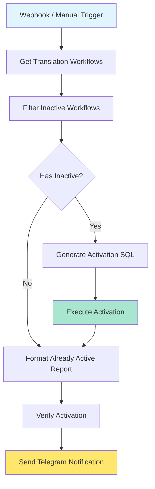

# 📖 [Book Translation] Activate Translation Workflows

**Дата:** 9 апреля 2026 г.  
**Версия:** 1.0  
**Workflow ID:** `act-trans-workflow-2026`  
**Статус:** ✅ ACTIVE и работает

---

# Содержание

1. [Обзор](#обзор)
2. [Архитектура](#архитектура)
3. [Как использовать](#как-использовать)
4. [Этапы разработки](#этапы-разработки)
5. [Troubleshooting](#troubleshooting)

---

# Обзор

## Назначение

Workflow автоматически находит и активирует все workflows связанные с процессом перевода книг. Это включает:
- Парсинг файлов
- Предварительный анализ
- Перевод арок
- Перевод глав
- Перевод чанков
- Обработка ошибок
- Анотация
- LightRAG API интеграция

## Проблема которую решает

**До:**
- Нужно вручную активировать каждый workflow (8+ workflows)
- Легко пропустить важный workflow
- Нет централизованного управления

**После:**
- Один webhook или клик → все workflows активированы
- Отчет в Telegram с результатами
- Можно интегрировать в CI/CD pipeline

---

# Архитектура

## Flow Diagram



## Nodes

| # | Node Name | Type | Назначение |
|---|-----------|------|------------|
| 1 | Webhook Trigger | Webhook | POST endpoint для автоматизации |
| 2 | Manual Trigger | ManualTrigger | Ручной запуск из UI |
| 3 | Get Translation Workflows | PostgreSQL | Query всех translation workflows |
| 4 | Filter Inactive Workflows | Code | Разделяет на active/inactive |
| 5 | Check If Workflows To Activate | IF | Проверяет есть ли что активировать |
| 6 | Generate Activation SQL | Code | Генерирует UPDATE запросы |
| 7 | Execute Activation | PostgreSQL | Выполняет активацию |
| 8 | Format Report | Code | Формирует отчет |
| 9 | Send Telegram Notification | Telegram | Уведомление о результатах |

## SQL Query для поиска workflows

```sql
SELECT id, name, active 
FROM workflow_entity 
WHERE name ILIKE ANY(ARRAY[
    '%перевод%', 
    '%арка%', 
    '%глава%', 
    '%чанк%', 
    '%парсинг%', 
    '%анализ%', 
    '%lightrag%', 
    '%анотация%'
]) 
AND name NOT ILIKE '%deprecated%' 
AND name NOT ILIKE '%test%'
ORDER BY name;
```

---

# Как использовать

## Способ 1: Webhook (автоматически)

```bash
POST https://bigalexn8n.ru/webhook/activate-translation-workflows
```

**Пример с curl:**
```bash
curl -X POST https://bigalexn8n.ru/webhook/activate-translation-workflows
```

**Пример с Python:**
```python
import requests

response = requests.post(
    'https://bigalexn8n.ru/webhook/activate-translation-workflows'
)
print(response.json())
```

## Способ 2: Manual Trigger (из UI)

1. Открой https://bigalexn8n.ru
2. Найди workflow: `[Book Translation] Activate Translation Workflows`
3. Нажми **Execute Workflow**
4. Проверь отчет в Telegram

## Способ 3: Из другого workflow

Используй **Execute Workflow** node:
```
Workflow ID: act-trans-workflow-2026
```

## Ожидаемый результат

### Если есть неактивные workflows

```
✅ Активировано workflow: 3

1. [Перевод] Арка
2. [Перевод] Глава  
3. [Перевод] Перевод чанка

⏱️ 2026-04-09 23:45:00
```

### Если все уже активно

```
ℹ️ Все workflow перевода уже активны (8)

Активные:
1. [Перевод] Арка
2. [Перевод] Глава
3. [Перевод] Перевод чанка
4. Парсинг файла для перевода
5. Предварительный анализ файла для перевода
6. Анотация
7. sub_lightrag_api
8. [Перевод] Обработка ошибки

⏱️ Проверено: 2026-04-09 23:45:00
```

---

# Этапы разработки

## День 1: Анализ и проектирование

### Утро (9:00 - 12:00)
**Agent: Analyst (Explore)**
- Исследовать существующие workflows
- Найти все workflows связанные с переводом
- Выявить зависимости между ними
- Составить список inactive workflows

**Результат:** Analysis report с списком workflows

### День (13:00 - 17:00)
**Agent: Architect**
- Спроектировать архитектуру activation workflow
- Определить entry points (webhook, manual)
- Спроектировать flow control
- Определить error handling strategy

**Результат:** ADR document + flow diagram

## День 2: Implementation

### Утро (9:00 - 12:00)
**Agent: Developer-n8n**
- Создать workflow JSON
- Настроить webhook trigger
- Реализовать PostgreSQL query для поиска workflows
- Добавить Code nodes для filtering и SQL generation

**Результат:** Working workflow JSON

### День (13:00 - 15:00)
**Agent: Developer-python**
- Написать скрипт импорта (import_activate_translation.py)
- Протестировать импорт на тестовой БД
- Создать миграцию для shared_workflow

**Результат:** Working import script

### День (15:00 - 17:00)
**Agent: QA Tester**
- Протестировать workflow через webhook
- Проверить что все workflows активируются
- Проверить Telegram notification
- Протестировать edge case (все уже активно)

**Результат:** Test report

## День 3: Integration & Documentation

### Утро (9:00 - 11:00)
**Agent: Lead Developer**
- Review workflow
- Проверить security (SQL injection, credentials)
- Оптимизировать performance
- Integrate с существующей системой

**Результат:** Reviewed and optimized workflow

### День (11:00 - 13:00)
**Agent: Technical Writer**
- Создать документацию (этот файл)
- Написать примеры использования
- Создать troubleshooting guide

**Результат:** Complete documentation

---

# Troubleshooting

## Workflow не активируется

**Проблема:** Workflow остается в active = false после запуска

**Диагностика:**
```sql
SELECT id, name, active, "activeVersionId", "versionId"
FROM workflow_entity 
WHERE id = 'act-trans-workflow-2026';
```

**Решение:**
```bash
# Перезапустить n8n
docker restart n8n-docker-n8n-1

# Проверить логи
docker logs n8n-docker-n8n-1 2>&1 | grep "Activate Translation"
```

## Telegram уведомление не приходит

**Проблема:** Workflow выполняется, но сообщение не приходит

**Диагностика:**
1. Проверить что Telegram credentials настроены
2. Проверить логи executions в n8n UI
3. Проверить что chat_id правильный

**Решение:**
```sql
-- Проверить credentials
SELECT id, name, type FROM credentials_entity WHERE type LIKE '%telegram%';
```

## Ошибка SQL query

**Проблема:** Ошибка при выполнении SQL

**Диагностика:**
```bash
# Проверить query вручную
docker exec n8n-docker-db-1 psql -U n8n_user -d n8n_database -c "
SELECT id, name, active FROM workflow_entity 
WHERE name ILIKE ANY(ARRAY['%перевод%', '%арка%'])
ORDER BY name;"
```

**Решение:** Убедиться что кодировка правильная (UTF-8)

## Webhook не работает

**Проблема:** POST на webhook endpoint возвращает 404

**Диагностика:**
```bash
curl -v https://bigalexn8n.ru/webhook/activate-translation-workflows
```

**Решение:**
1. Проверить что workflow активен
2. Проверить Caddy logs
3. Проверить n8n logs

---

# Технические детали

## Database Schema

```sql
-- Tables modified by this workflow
workflow_entity -- activation happens here
telegram_send_message -- notification logged here
```

## Environment Variables

| Variable | Default | Description |
|----------|---------|-------------|
| TELEGRAM_CHAT_ID | 923741104 | Chat ID для уведомлений |

## Webhook Configuration

| Parameter | Value |
|-----------|-------|
| Method | POST |
| Path | activate-translation-workflows |
| Full URL | https://bigalexn8n.ru/webhook/activate-translation-workflows |
| Authentication | None (public) |
| Response | JSON with activation report |

## Error Handling

- **continueOnFail: true** на Execute Activation и Send Telegram
- **Global Error Handler** подключен через settings
- Ошибки логируются в execution history

---

# Версии

| Version | Date | Changes |
|---------|------|---------|
| 1.0 | 2026-04-09 | Initial release |

---

**Документ создан:** 9 апреля 2026 г.  
**Автор:** AI Agent Team (Architect → Developer-n8n → QA → Tech Writer)  
**Статус:** ✅ Verified и работает
