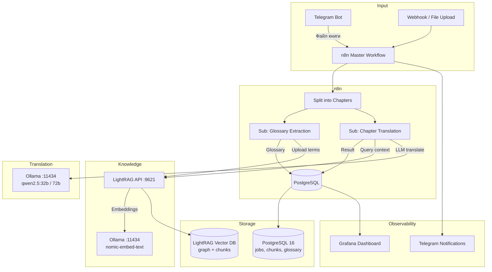

# ADR-001: Архитектура системы автоматического перевода книг (KO→RU)

**Статус:** Proposed  
**Дата:** 2026-04-10  
**Контекст:** Автоматизация перевода художественных книг с корейского на русский с сохранением контекста, имён, терминов и стиля.

---

## 1. Компонентная диаграмма

---

## 2. Ключевые архитектурные решения

### 2.1. n8n как orchestrator
**Решение:** Основной workflow разбивает книгу на главы, запускает sub-workflows для перевода и извлечения глоссария.  
**Обоснование:** n8n уже развёрнут, имеет встроенную retry-логику, error handling, и интеграцию с PostgreSQL/Telegram. Sub-workflows обеспечивают переиспользование (glossary, translation, quality check).

### 2.2. LightRAG как семантическая память
**Решение:** LightRAG хранит граф знаний (имена, места, термины) и обеспечивает контекст при переводе каждой главы.  
**Обоснование:** Graph-based RAG лучше обычного vector search для художественного текста — сохраняет связи между сущностями (кто кому, где находится). Режим `mix` даёт оптимальное покрытие (local + global retrieval). Уже развёрнут на хосте (`lightrag.bigalexn8n.ru`).

### 2.3. Ollama для LLM inference
**Решение:** `qwen2.5:32b` или `72b` для перевода, `nomic-embed-text` для эмбеддингов.  
**Обоснование:** Локальный запуск (без API costs), qwen2.5 показал лучшее качество для KO→RU среди open-source моделей. nomic-embed-text совместим с LightRAG.

### 2.4. PostgreSQL как primary store
**Решение:** Таблицы `book_translation_jobs`, `document_chunks`, `glossary_terms`.  
**Обоснование:** PostgreSQL уже используется n8n. ACID-гарантии для трекинга прогресса, rollback при ошибках. LightRAG использует собственный векторный store (ChromaDB/local files) — разделение ответственности.

### 2.5. Двухфазный pipeline
**Решение:** Фаза 1 — извлечение глоссария из первой главы + загрузка в LightRAG. Фаза 2 — последовательный перевод глав с query контекста из LightRAG.  
**Обоснование:** Glossary из первой главы задаёт терминологию для всех последующих. Последовательный перевод (не параллельный) гарантирует, что контекст предыдущих глав доступен через LightRAG.

---

## 3. Риски и mitigation

| Риск | Вероятность | Impact | Mitigation |
|------|------------|--------|------------|
| **Ollama down** | Средняя | Высокий | Circuit breaker (3 ошибки → pause 30s), retry с exponential backoff, алерт в Telegram |
| **LightRAG context miss** | Средняя | Средний | Fallback: query по БД напрямую (LIKE/FTS), деградация к переводу без контекста |
| **Контекст qwen2.5 (32k)** | Высокая | Высокий | Chunking глав по 4-8k токенов, stateful summarization длинных глав |
| **Несогласованность имён** | Средняя | Средний | Glossary extraction из первых 3 глав, принудительная подстановка через системный промпт |
| **Потеря состояния** | Низкая | Критический | PostgreSQL WAL, checkpoint после каждой главы, idempotent workflow |
| **Скорость перевода** | Высокая | Средний | Batch перевод похожих глав (параллелизм 2-3), асинхронный LightRAG upload |

---

## 4. Стек (итог)

| Компонент | Технология | Порт/URL | Назначение |
|-----------|-----------|----------|------------|
| Orchestrator | n8n | `:5678` | Pipeline management, error handling |
| RAG | LightRAG | `:9621` | Graph-based context retrieval |
| LLM | Ollama (qwen2.5) | `:11434` | KO→RU translation, embeddings |
| Storage | PostgreSQL 16 | `:5432` | Jobs, chunks, glossary, logs |
| Notifications | Telegram Bot | API | Progress alerts, error reports |
| Dashboard | Grafana | `:3000` | Metrics visualization |
