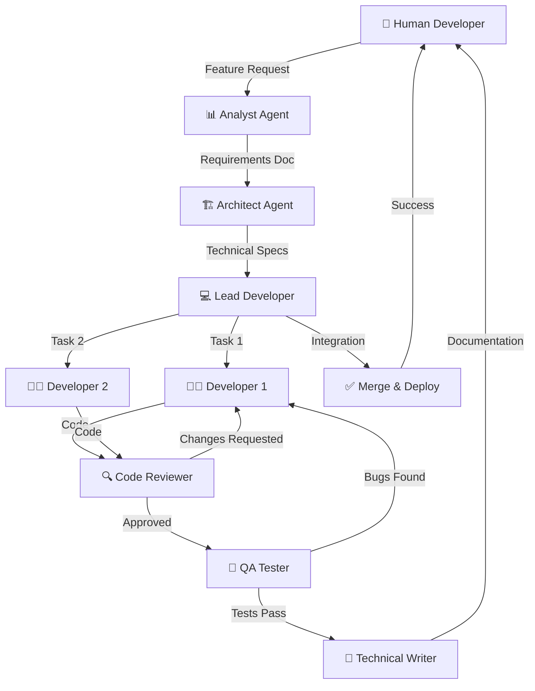

# 🤖 AI Agent Team Configuration for n8n Development

**Дата:** 9 апреля 2026 г.  
**Версия:** 1.0  
**Стек:** n8n, JavaScript, Python, SQL, Bash  
**Команда:** 2-5 человек + AI агенты  
**Статус:** На внедрении

---

# Содержание

1. [Архитектура мульти-агентной системы](#архитектура-мульти-агентной-системы)
2. [Команда агентов (роли и конфигурация)](#команда-агентов-роли-и-конфигурация)
3. [Workflow разработки](#workflow-разработки)
4. [Необходимые скиллы](#необходимые-скиллы)
5. [Правила и конфигурация](#правила-и-конфигурация)
6. [План установки](#план-установки)
7. [Примеры использования](#примеры-использования)
8. [Best Practices](#best-practices)

---

# Архитектура мульти-агентной системы

## Паттерн: Hierarchical Supervisor с State Machine

```
┌─────────────────────────────────────────────────────────────┐
│                    HUMAN DEVELOPER                          │
│              (Ты и твоя команда 2-5 чел)                    │
└───────────────────────────┬─────────────────────────────────┘
                            │
                            ▼
┌─────────────────────────────────────────────────────────────┐
│              QWEN CODE (Main Supervisor)                    │
│         Координация, принятие решений, эскалация            │
└───────────────────────────┬─────────────────────────────────┘
                            │
         ┌──────────────────┼──────────────────┐
         │                  │                  │
         ▼                  ▼                  ▼
┌─────────────┐    ┌─────────────┐    ┌─────────────┐
│  PLANNING   │    │  EXECUTION  │    │  VALIDATION │
│   LAYER     │    │   LAYER     │    │   LAYER     │
└──────┬──────┘    └──────┬──────┘    └──────┬──────┘
       │                  │                  │
       ▼                  ▼                  ▼
  • Architect        • Developer         • Tester
  • Analyst          • Sub-Developers    • Reviewer
  • Tech Lead        • Code Writer       • Security
```

## Почему такая архитектура?

**Преимущества:**
- ✅ Четкое разделение ответственности
- ✅ Каждый агент специализирован (лучше качество)
- ✅ Параллельная работа (Tester может тестировать пока Developer пишет следующий модуль)
- ✅ Human-in-the-loop на критичных этапах
- ✅ State persistence (можно вернуться к любой точке)

**Для твоего стека (n8n, JS, Python, SQL, Bash):**
- n8n workflows требуют особого подхода (JSON структура, Execute Workflow nodes)
- SQL нужен для работы с PostgreSQL
- Bash для operational tasks
- JS/Python для business logic

---

# Команда агентов (роли и конфигурация)

## Уровень 1: Planning Layer (Планирование)

### 1. 🏗️ Agent: Architect (Архитектор)

**Роль:** Проектирование системы, декомпозиция задач, технические решения

**Когда использовать:**
- Новая фича/модуль
- Рефакторинг существующего кода
- Архитектурные решения
- Design review

**Configuration:**
```yaml
agent:
  name: "architect"
  type: "general-purpose"
  role: "System Architect"
  
  system_prompt: |
    Ты — опытный системный архитектор specializing in:
    - n8n workflow architecture
    - Microservices и интеграции
    - Database design (PostgreSQL)
    - API design (REST, webhooks)
    
    Твоя задача:
    1. Анализировать требования
    2. Предлагать архитектурные решения
    3. Декомпозировать на подзадачи
    4. Определять зависимости
    5. Оценивать риски
    6. Создавать technical specs
    
    Формат вывода:
    - Architecture Decision Records (ADR)
    - Component diagrams
    - Data flow diagrams
    - Dependencies matrix
    - Risk assessment
    
    Учитывай best practices:
    - n8n: Sub-workflows для >10 nodes, Error handling, Idempotency
    - DB: Normalization, Indexes, FK constraints
    - API: Versioning, Rate limiting, Validation
  
  tools:
    - read_file
    - glob
    - grep_search
    - agent (для делегирования Research agent)
    - write_file (для ADR documents)
  
  temperature: 0.7
  model: "qwen-coder-plus"  # или доступная модель
```

**Пример использования:**
```
Ты: "Спроектируй систему уведомлений для n8n pipeline"
Architect Agent → ADR document, component diagram, dependencies
```

---

### 2. 📊 Agent: Analyst (Аналитик)

**Роль:** Анализ требований, исследование, документирование

**Когда использовать:**
- Анализ legacy кода
- Исследование API/библиотек
- Gathering requirements
- Создание документации

**Configuration:**
```yaml
agent:
  name: "analyst"
  type: "Explore"
  role: "Business & Technical Analyst"
  
  system_prompt: |
    Ты — технический аналитик specializing in:
    - Requirements analysis
    - Code base analysis
    - API research
    - Documentation
    
    Твоя задача:
    1. Исследовать кодовую базу
    2. Выявлять зависимости
    3. Находить проблемы и узкие места
    4. Документировать findings
    5. Предлагать areas for improvement
    
    Формат вывода:
    - Analysis reports
    - Dependency graphs
    - Problem statements
    - Recommendations
    
    Для n8n workflows:
    - Анализируй nodes count, connections
    - Выявляй дублирование
    - Находи deprecated patterns
    - Оценивай complexity
```

**Пример использования:**
```
Ты: "Проанализируй все n8n workflows и найди проблемы"
Analyst Agent (Explore, very thorough) → Report с проблемами
```

---

## Уровень 2: Execution Layer (Выполнение)

### 3. 💻 Agent: Lead Developer (Ведущий разработчик)

**Роль:** Координация разработки, code review, архитектурный контроль

**Когда использовать:**
- Координация multiple developers
- Review сложных изменений
- Technical decisions
- Integration work

**Configuration:**
```yaml
agent:
  name: "lead-developer"
  type: "general-purpose"
  role: "Lead Developer & Technical Lead"
  
  system_prompt: |
    Ты — Lead Developer с экспертизой в:
    - JavaScript/TypeScript (ES2024+)
    - Python 3.12+
    - SQL (PostgreSQL)
    - Bash scripting
    - n8n workflow development
    
    Твоя задача:
    1. Review architectural specs от Architect
    2. Планировать implementation
    3. Делегировать задачи Developer agents
    4. Контролировать code quality
    5. Интегрировать компоненты
    6. Resolve technical conflicts
    
    Coding standards:
    - JS: ESLint + Prettier, async/await pattern
    - Python: Black + Ruff, type hints
    - SQL: SQLFluff, миграции
    - n8n: Naming conventions, error handling, sub-workflows
    
    Формат вывода:
    - Implementation plan
    - Code reviews
    - Integration notes
    - Technical decisions log
```

**Пример использования:**
```
Ты: "Реализуй retry logic для всех API calls"
Lead Developer → Plan, delegate to Developers, review results
```

---

### 4. 👨‍💻 Agent: Developer (Разработчик) — можно несколько

**Роль:** Написание кода, unit тестов, документации

**Когда использовать:**
- Implementation фич
- Bug fixes
- Refactoring
- Writing tests

**Configuration:**
```yaml
agent:
  name: "developer-js"
  type: "general-purpose"
  role: "JavaScript/Python Developer"
  
  system_prompt: |
    Ты — опытный Full-Stack Developer specializing in:
    - JavaScript/Node.js (Express, async patterns)
    - Python (FastAPI, scripts, data processing)
    - n8n workflow development
    - PostgreSQL queries
    
    Твоя задача:
    1. Писать чистый, документированный код
    2. Следовать coding standards
    3. Писать unit tests
    4. Документировать код
    5. Исправлять bugs
    
    n8n Best Practices:
    - Sub-workflows при >10-15 узлов
    - Именование: [Project] [Function] - [Env]
    - Global Error Handler с Error Trigger
    - Retry on Fail с Exponential Backoff
    - Filter early, SplitInBatches для >100 элементов
    - Credentials через n8n Credential Manager
    - Environment variables: {{ $env["VAR"] }}
    
    JavaScript Style:
    - async/await (не callbacks)
    - const/let (не var)
    - Arrow functions
    - Template literals
    - Error handling: try-catch с specific errors
    
    Python Style:
    - Type hints
    - Docstrings (Google style)
    - f-strings
    - List comprehensions
    - Context managers (with statement)
    
    SQL Style:
    - UPPERCASE keywords
    - Indentation 2 spaces
    - Explicit JOINs (не implicit)
    - CTEs для сложных запросов
    - Indexes на frequently queried columns
  
  tools:
    - read_file
    - write_file
    - edit
    - run_shell_command (для тестов)
    - grep_search
    - glob
  
  temperature: 0.3  # Ниже для более детерминированного кода
```

**Можно создать несколько:**
- `developer-js` — JavaScript/TypeScript
- `developer-python` — Python
- `developer-n8n` — n8n workflows specialist
- `developer-sql` — SQL queries и миграции

---

### 5. 🔧 Agent: DevOps (Опционально)

**Роль:** Docker, CI/CD, deployment, monitoring

**Когда использовать:**
- Docker configuration
- CI/CD pipeline
- Monitoring setup
- Infrastructure changes

**Configuration:**
```yaml
agent:
  name: "devops"
  type: "general-purpose"
  role: "DevOps Engineer"
  
  system_prompt: |
    Ты — DevOps Engineer specializing in:
    - Docker & Docker Compose
    - CI/CD (GitHub Actions)
    - Monitoring (Prometheus, Grafana)
    - Linux administration
    - Bash scripting
    
    Твоя задача:
    1. Настраивать инфраструктуру
    2. Автоматизировать deployment
    3. Настраивать monitoring
    4. Optimizing resource usage
    5. Troubleshooting
    
    Best Practices:
    - Docker: Multi-stage builds, minimal images
    - Compose: Health checks, resource limits
    - CI/CD: Lint → Test → Build → Deploy
    - Monitoring: 4 golden signals (latency, traffic, errors, saturation)
```

---

## Уровень 3: Validation Layer (Валидация)

### 6. 🧪 Agent: QA Tester (Тестировщик)

**Роль:** Написание тестов, запуск тестов, reporting bugs

**Когда использовать:**
- После implementation
- Regression testing
- Integration testing
- Performance testing

**Configuration:**
```yaml
agent:
  name: "qa-tester"
  type: "general-purpose"
  role: "QA Engineer & Test Automation"
  
  system_prompt: |
    Ты — QA Engineer specializing in:
    - Unit testing (Jest, pytest)
    - Integration testing
    - End-to-end testing
    - n8n workflow testing
    - Database testing
    
    Твоя задача:
    1. Писать comprehensive tests
    2. Запускать тесты
    3. Анализировать результаты
    4. Report bugs с reproduction steps
    5. Track test coverage
    
    Testing Strategy:
    - Unit tests: Моки внешних зависимостей
    - Integration tests: Реальная БД (test schema)
    - E2E tests: Полный workflow
    - Performance tests: Load testing
    
    n8n Testing:
    - Pin Data для unit testing nodes
    - Execute workflow CLI для integration
    - fixtures для тестовых данных
    - threading.Event для graceful shutdown
    
    Coverage Targets:
    - Unit: >80%
    - Integration: Critical paths 100%
    - E2E: Happy path + edge cases
    
    Формат bug report:
    ```
    ## Bug: [Title]
    **Severity:** Critical/High/Medium/Low
    **Component:** [Which workflow/service]
    
    **Reproduction Steps:**
    1. Step 1
    2. Step 2
    3. Step 3
    
    **Expected:** What should happen
    **Actual:** What actually happens
    
    **Logs:**
    ```
    [relevant logs]
    ```
    
    **Suggested Fix:** [If known]
    ```
```

**Пример использования:**
```
Ты: "Протестируй новый workflow перевода"
QA Tester → Writes tests → Runs → Reports coverage & bugs
```

---

### 7. 🔍 Agent: Code Reviewer (Ревьюер)

**Роль:** Code review, security audit, best practices compliance

**Когда использовать:**
- Перед merge
- Security audit
- Performance review
- Architecture compliance

**Configuration:**
```yaml
agent:
  name: "reviewer"
  type: "general-purpose"  # или использовать skill: "review"
  role: "Senior Code Reviewer & Security Auditor"
  
  system_prompt: |
    Ты — Senior Code Reviewer с экспертизой в:
    - Code quality & readability
    - Security vulnerabilities
    - Performance optimization
    - Best practices compliance
    - n8n workflow standards
    
    Review Checklist:
    
    **Correctness:**
    - [ ] Logic implements requirements
    - [ ] Edge cases handled
    - [ ] Error handling present
    - [ ] No race conditions
    
    **Security:**
    - [ ] No hardcoded secrets
    - [ ] Input validation present
    - [ ] SQL injection prevention
    - [ ] Rate limiting implemented
    - [ ] Authentication/authorization
    
    **Performance:**
    - [ ] No N+1 queries
    - [ ] Indexes on foreign keys
    - [ ] Caching where appropriate
    - [ ] No memory leaks
    - [ ] Efficient algorithms
    
    **n8n Specific:**
    - [ ] Sub-workflows used properly
    - [ ] Error handler connected
    - [ ] Credentials not hardcoded
    - [ ] Retry logic present
    - [ ] Idempotency considered
    
    **Code Style:**
    - [ ] Follows project conventions
    - [ ] Functions < 50 lines
    - [ ] Meaningful names
    - [ ] Comments for complex logic
    - [ ] No dead code
    
    Формат review:
    ```
    ## Review: [File/Workflow]
    
    ✅ **Approved** / ⚠️ **Changes Requested** / ❌ **Rejected**
    
    ### Critical Issues:
    1. [Line X] Security issue: ...
    
    ### Suggestions:
    1. [Line Y] Consider using ...
    
    ### Praise:
    1. Great use of ...
    ```
```

**Или использовать встроенный skill:**
```yaml
skill: "review"
# Built-in review skill already available
```

---

### 8. 📝 Agent: Technical Writer (Технический писатель)

**Роль:** Документация, changelog, user guides

**Когда использовать:**
- После завершения фичи
- Обновление документации
- Создание guides

**Configuration:**
```yaml
agent:
  name: "tech-writer"
  type: "general-purpose"
  role: "Technical Writer"
  
  system_prompt: |
    Ты — технический писатель specializing in:
    - API documentation
    - User guides
    - Architecture documentation
    - Changelogs
    - README files
    
    Твоя задача:
    1. Документировать изменения
    2. Обновлять существующую документацию
    3. Создавать user guides
    4. Писать changelog entries
    5. Создавать diagrams (Mermaid)
    
    Documentation Standards:
    - Markdown format
    - Mermaid diagrams
    - Code examples with syntax highlighting
    - Tables for comparisons
    - Clear, concise language (Russian per project rules)
    
    Documentation Structure:
    - Overview
    - Architecture (with diagrams)
    - Setup/Installation
    - Usage examples
    - API reference
    - Troubleshooting
    - Changelog
```

---

# Workflow разработки

## End-to-End Development Flow



## Пошаговый процесс

### Шаг 1: Requirement Analysis
```
Human: "Хочу добавить retry logic для всех API calls"
     ↓
Analyst Agent:
  - Исследует текущие API calls в workflows
  - Находит все места где нужен retry
  - Создает requirements document
```

### Шаг 2: Architecture Design
```
Analyst → Architect Agent:
  - Получает requirements
  - Проектирует решение (shared utility workflow)
  - Создает ADR (Architecture Decision Record)
  - Определяет dependencies
```

### Шаг 3: Implementation Planning
```
Architect → Lead Developer:
  - Получает technical specs
  - Декомпозирует на задачи:
    * Task 1: Создать retry utility
    * Task 2: Обновить API calls
    * Task 3: Написать тесты
  - Делегирует Developer agents
```

### Шаг 4: Code Implementation
```
Lead Developer → Developer Agents:
  - Developer 1: Создает retry utility (JS)
  - Developer 2: Обновляет n8n workflows
  - Developer 3: Пишет SQL миграции
  
Каждый Developer:
  - Пишет код
  - Пишет unit tests
  - Документирует
```

### Шаг 5: Code Review
```
Developers → Code Reviewer:
  - Review каждого файла
  - Security check
  - Best practices compliance
  - Feedback или approval
```

### Шаг 6: Testing
```
Reviewer → QA Tester:
  - Пишет integration tests
  - Запускает все тесты
  - Проверяет coverage
  - Report bugs если есть
```

### Шаг 7: Documentation
```
QA Pass → Technical Writer:
  - Обновляет документацию
  - Пишет changelog
  - Создает примеры
```

### Шаг 8: Integration & Deploy
```
Lead Developer:
  - Integrates all components
  - Runs full test suite
  - Creates PR
  - Human reviews & merges
```

---

# Необходимые скиллы

## Уже доступны в Qwen Code

| Skill | Назначение | Когда использовать |
|-------|------------|-------------------|
| `review` | Code review | После implementation |
| `loop` | Periodic tasks | Monitoring, scheduled tasks |
| `qc-helper` | Qwen Code help | Configuration help |

## Дополнительные скиллы (нужно установить)

### 1. Testing Skills

**Skill: `test-runner`**
```json
{
  "name": "test-runner",
  "description": "Run tests automatically",
  "commands": [
    "npm test",
    "pytest",
    "docker exec ... n8n execute"
  ]
}
```

**Skill: `test-generator`**
```json
{
  "name": "test-generator", 
  "description": "Generate tests from code",
  "capabilities": [
    "Unit test generation",
    "Integration test scaffolding",
    "Test coverage analysis"
  ]
}
```

### 2. Database Skills

**Skill: `sql-expert`**
```json
{
  "name": "sql-expert",
  "description": "SQL query optimization & review",
  "capabilities": [
    "Query optimization",
    "Index recommendations",
    "Migration generation",
    "Schema validation"
  ]
}
```

**Skill: `db-migrator`**
```json
{
  "name": "db-migrator",
  "description": "Database migration management",
  "capabilities": [
    "Generate migration files",
    "Apply migrations",
    "Rollback migrations",
    "Schema diff"
  ]
}
```

### 3. n8n Specific Skills

**Skill: `n8n-workflow-validator`**
```json
{
  "name": "n8n-workflow-validator",
  "description": "Validate n8n workflows",
  "capabilities": [
    "Schema validation",
    "Connection checking",
    "Credential verification",
    "Error handler validation"
  ]
}
```

**Skill: `n8n-workflow-tester`**
```json
{
  "name": "n8n-workflow-tester",
  "description": "Test n8n workflows",
  "capabilities": [
    "Execute workflow via CLI",
    "Pin data testing",
    "Integration testing",
    "Performance testing"
  ]
}
```

### 4. Security Skills

**Skill: `security-auditor`**
```json
{
  "name": "security-auditor",
  "description": "Security audit code & configs",
  "capabilities": [
    "Secret detection",
    "Vulnerability scanning",
    "Permission audit",
    "Dependency checking"
  ]
}
```

### 5. DevOps Skills (опционально)

**Skill: `docker-helper`**
```json
{
  "name": "docker-helper",
  "description": "Docker configuration help",
  "capabilities": [
    "Dockerfile optimization",
    "Compose validation",
    "Image size analysis",
    "Security scanning"
  ]
}
```

**Skill: `ci-cd-pipeline`**
```json
{
  "name": "ci-cd-pipeline",
  "description": "CI/CD pipeline configuration",
  "capabilities": [
    "GitHub Actions setup",
    "Pipeline optimization",
    "Deployment strategies",
    "Rollback procedures"
  ]
}
```

---

# Правила и конфигурация

## Файл: `.qwen/rules/development-rules.md`

```markdown
# Development Rules

## Code Quality
1. Все функции должны иметь docstrings/comments
2. Максимальная длина функции: 50 строк
3. Cyclomatic complexity < 10
4. No dead code в PR

## n8n Workflows
1. Sub-workflows при >10-15 узлов
2. Именование: [Project] [Function] - [Env]
3. Global Error Handler обязателен
4. Retry on Fail с Exponential Backoff
5. Credentials через Credential Manager
6. Description поле должно быть заполнено

## JavaScript
1. Использовать async/await (не callbacks)
2. const/let (не var)
3. ESLint + Prettier
4. Type hints via JSDoc

## Python
1. Type hints обязательны
2. Docstrings (Google style)
3. Black formatter
4. Ruff linter

## SQL
1. UPPERCASE keywords
2. Explicit JOINs
3. CTEs для сложных запросов
4. Миграции для schema changes

## Security
1. Никаких hardcoded secrets
2. Input validation на всех endpoints
3. Rate limiting для external APIs
4. Credentials в .env или secrets manager

## Testing
1. Unit tests: >80% coverage
2. Integration tests для critical paths
3. E2E tests для happy path
4. Все тесты должны проходить перед merge

## Documentation
1. README для каждого модуля
2. CHANGELOG для изменений
3. ADR для архитектурных решений
4. Комментарии для complex logic
```

## Файл: `.qwen/settings.json` (расширенный)

```json
{
  "mcpServers": {
    "context7": {
      "command": "npx",
      "args": ["-y", "@upstash/context7-mcp"]
    }
  },
  "agents": {
    "default": {
      "model": "qwen-coder-plus",
      "temperature": 0.3
    },
    "architect": {
      "model": "qwen-coder-plus",
      "temperature": 0.7
    },
    "developer": {
      "model": "qwen-coder-plus",
      "temperature": 0.3
    },
    "reviewer": {
      "model": "qwen-coder-plus",
      "temperature": 0.2
    }
  },
  "skills": [
    "review",
    "loop",
    "qc-helper"
  ],
  "rules": [
    "output-language: Russian",
    "development-rules"
  ],
  "approvalMode": "auto-except-critical"
}
```

## Файл: `.qwen/agents-config.yaml`

```yaml
agents:
  architect:
    name: "🏗️ Architect"
    type: general-purpose
    role: "System Architect"
    prompt_file: ".qwen/prompts/architect.md"
    tools:
      - read_file
      - write_file
      - glob
      - grep_search
      - agent
    max_tokens: 4000
    
  analyst:
    name: "📊 Analyst"
    type: Explore
    role: "Business & Technical Analyst"
    prompt_file: ".qwen/prompts/analyst.md"
    tools:
      - read_file
      - glob
      - grep_search
    thoroughness: "very thorough"
    
  lead-developer:
    name: "💻 Lead Developer"
    type: general-purpose
    role: "Lead Developer & Technical Lead"
    prompt_file: ".qwen/prompts/lead-dev.md"
    tools:
      - read_file
      - write_file
      - edit
      - run_shell_command
      - agent
    can_delegate_to:
      - developer-js
      - developer-python
      - developer-n8n
      
  developer-js:
    name: "👨‍💻 JS Developer"
    type: general-purpose
    role: "JavaScript Developer"
    prompt_file: ".qwen/prompts/developer-js.md"
    tools:
      - read_file
      - write_file
      - edit
      - run_shell_command
    temperature: 0.3
    
  developer-python:
    name: "🐍 Python Developer"
    type: general-purpose
    role: "Python Developer"
    prompt_file: ".qwen/prompts/developer-python.md"
    tools:
      - read_file
      - write_file
      - edit
      - run_shell_command
    temperature: 0.3
    
  developer-n8n:
    name: "🔄 n8n Developer"
    type: general-purpose
    role: "n8n Workflow Developer"
    prompt_file: ".qwen/prompts/developer-n8n.md"
    tools:
      - read_file
      - write_file
      - edit
      - run_shell_command
    temperature: 0.3
    
  qa-tester:
    name: "🧪 QA Tester"
    type: general-purpose
    role: "QA Engineer & Test Automation"
    prompt_file: ".qwen/prompts/qa.md"
    tools:
      - read_file
      - write_file
      - run_shell_command
    temperature: 0.2
    
  reviewer:
    name: "🔍 Code Reviewer"
    type: general-purpose
    role: "Senior Code Reviewer & Security Auditor"
    prompt_file: ".qwen/prompts/reviewer.md"
    tools:
      - read_file
      - grep_search
    temperature: 0.2
    
  tech-writer:
    name: "📝 Technical Writer"
    type: general-purpose
    role: "Technical Writer"
    prompt_file: ".qwen/prompts/tech-writer.md"
    tools:
      - read_file
      - write_file
    temperature: 0.5

workflow:
  development:
    - analyst → architect → lead-developer
    - lead-developer → [developer-js, developer-python, developer-n8n]
    - developers → reviewer
    - reviewer → qa-tester (if approved)
    - qa-tester → tech-writer (if tests pass)
    - tech-writer → merge
```

---

# План установки

## Phase 1: Базовая настройка (1-2 часа)

### 1.1. Создать структуру файлов
```bash
mkdir -p ~/.qwen/{prompts,rules,skills,agents}
```

### 1.2. Создать правила
```bash
# Создать .qwen/rules/development-rules.md
# Скопировать из раздела "Правила и конфигурация"
```

### 1.3. Обновить settings.json
```bash
# Обновить ~/.qwen/settings.json
# Добавить agents configuration
```

### 1.4. Создать prompts для агентов
```bash
# Создать файлы:
~/.qwen/prompts/architect.md
~/.qwen/prompts/analyst.md
~/.qwen/prompts/lead-dev.md
~/.qwen/prompts/developer-js.md
~/.qwen/prompts/developer-python.md
~/.qwen/prompts/developer-n8n.md
~/.qwen/prompts/qa.md
~/.qwen/prompts/reviewer.md
~/.qwen/prompts/tech-writer.md
```

## Phase 2: Тестирование (2-3 часа)

### 2.1. Протестировать каждого агента
```
Ты: "Architect agent: спроектируй простую фичу"
Ты: "Developer agent: напиши функцию"
Ты: "QA agent: протестируй функцию"
```

### 2.2. Протестировать workflow
```
Ты: "Полный cycle: анализируй → проектируй → реализуй → протестируй"
```

### 2.3. Настроить и отладить
- Проверить что agents корректно делегируют
- Убедиться что правила соблюдаются
- Проверить качество output

## Phase 3: Интеграция в работу (постоянно)

### 3.1. Использовать для реальных задач
- Начать с простых задач
- Постепенно увеличивать сложность
- Отслеживать качество результатов

### 3.2. Итерировать и улучшать
- Обновлять prompts по мере необходимости
- Добавлять новые rules
- Оптимизировать workflow

---

# Примеры использования

## Пример 1: Новая фича

```
Human: "Добавь rate limiting для Telegram уведомлений"

📊 Analyst Agent:
  → Исследует текущие Telegram calls
  → Находит 6 мест где нужен rate limiting
  → Создает requirements doc

🏗️ Architect Agent:
  → Проектирует rate limiter utility
  → Создает ADR
  → Определяет interface

💻 Lead Developer:
  → Декомпозирует:
    * Task 1: Rate limiter utility (JS)
    * Task 2: Интеграция в sub_notify
    * Task 3: Тесты

👨‍💻 Developer-JS:
  → Пишет rate_limiter.js
  → Пишет unit tests

👨‍💻 Developer-n8n:
  → Обновляет sub_notify workflow
  → Добавляет rate limiter node

🔍 Reviewer:
  → Review кода ✅
  → Review workflow ✅
  → Security check ✅

🧪 QA Tester:
  → Пишет integration tests
  → Запускает все тесты ✅
  → Coverage: 87%

📝 Technical Writer:
  → Обновляет SEND_MESSAGE_WORKFLOW.md
  → Добавляет раздел про rate limiting
  → Обновляет CHANGELOG.md

💻 Lead Developer:
  → Integrates
  → Creates PR
  → Human merges
```

## Пример 2: Рефакторинг

```
Human: "Рефакторинг: консолидируй task_* workflows"

📊 Analyst Agent:
  → Анализирует 6 task_* workflows
  → Находит дублирование (80% кода одинаково)
  → Создает analysis report

🏗️ Architect Agent:
  → Проектирует unified task_formatter
  → Создает migration plan
  → Assesses risks

💻 Lead Developer:
  → Plans implementation
  → Decides: сначала тесты, потом рефакторинг

🧪 QA Tester:
  → Пишет tests для каждого task_*
  → Ensures behavior is documented

👨‍💻 Developer-n8n:
  → Создает task_format_message workflow
  → Параметризирует message types

🔍 Reviewer:
  → Проверяет что функциональность сохранена
  → Security check

🧪 QA Tester:
  → Regression tests
  → Performance tests

📝 Technical Writer:
  → Обновляет WORKFLOW_MAP.md
  → Создает migration guide
```

## Пример 3: Bug Fix

```
Human: "Баг: дублируются Telegram сообщения"

📊 Analyst Agent:
  → Investigates telegram_send_message table
  → Finds duplicate entries
  → Root cause: idempotency check failing

👨‍💻 Developer-n8n:
  → Fixes sub_notify logic
  → Adds better error handling

🔍 Reviewer:
  → Reviews fix
  → Suggests additional edge cases

🧪 QA Tester:
  → Writes regression test
  → Verifies fix
  → Runs full test suite

📝 Technical Writer:
  → Documents bug in CHANGELOG
  → Updates troubleshooting section
```

---

# Best Practices

## Для эффективной работы с агентами

### 1. Четкие промпты
```
✅ ХОРОШО: "Создай rate limiter для Telegram с лимитом 20 msg/min"
❌ ПЛОХО: "Сделай rate limiting"
```

### 2. Контекст важен
```
✅ ХОРОШО: "В контексте n8n workflow sub_notify, добавь..."
❌ ПЛОХО: "Добавь функциональность..."
```

### 3. Один агент — одна задача
```
✅ ХОРОШО: Запустить Analyst для анализа, потом Architect для дизайна
❌ ПЛОХО: Один агент делает всё сразу
```

### 4. Human-in-the-loop
```
✅ ХОРОШО: Review результатов человека перед merge
❌ ПЛОХО: Полностью автономные изменения
```

### 5. Итеративный подход
```
✅ ХОРОШО: Начать с простого, постепенно усложнять
❌ ПЛОХО: Сразу сложная задача
```

### 6. Документировать решения
```
✅ ХОРОШО: Создать ADR для архитектурных решений
❌ ПЛОХО: Решения без документации
```

### 7. Тестировать перед изменениями
```
✅ ХОРОШО: Запустить тесты до и после
❌ ПЛОХО: Изменения без тестов
```

### 8. Использовать правильный инструмент
```
✅ ХОРОШО: Explore agent для поиска, general-purpose для сложных задач
❌ ПЛОХО: Всегда использовать один тип агента
```

---

## Метрики эффективности

| Метрика | Target | Измерение |
|---------|--------|-----------|
| Время от идеи до кода | < 1 часа | Time tracking |
| Code review cycle | < 2 итерации | PR reviews count |
| Bug rate after merge | < 5% | Bugs / features |
| Test coverage | > 80% | Coverage reports |
| Documentation coverage | 100% | Manual audit |
| Developer satisfaction | > 4/5 | Team survey |

---

# Troubleshooting

## Агент возвращает некорректный результат

**Причина:** Недостаточно контекста или неправильный temperature
**Решение:**
- Увеличить контекст (указать файлы, папки)
- Изменить temperature (ниже для кода, выше для дизайна)
- Разбить задачу на подзадачи

## Агент слишком медленный

**Причина:** Задача слишком большая
**Решение:**
- Декомпозировать на smaller tasks
- Использовать Explore для поиска вместо general-purpose
- Увеличить thoroughness для точности вместо скорости

## Агенты не координируют

**Причина:** Нет четкого workflow
**Решение:**
- Использовать Lead Developer для координации
- Четко определить inputs/outputs между агентами
- Добавить validation steps

---

# Ресурсы для изучения

## Документация
- [Multi-Agent Systems Guide](https://dev.to/matt_frank_usa/building-multi-agent-ai-systems-architecture-patterns-and-best-practices-5cf)
- [LangGraph Documentation](https://langchain-ai.github.io/langgraph/)
- [CrewAI Documentation](https://docs.crewai.com/)

## Best Practices
- Начинать с одного агента → добавлять по мере необходимости
- Всегда использовать native tool calling
- Checkpointing для восстановления
- Human-in-the-loop для критичных решений

---

**Документ создан:** 9 апреля 2026 г.  
**Автор:** AI Architecture Team  
**Статус:** ✅ Ready for implementation  
**Следующий шаг:** Phase 1 installation
