# 🏗️ Архитектура n8n Translation System

**Дата:** 9 апреля 2026 г.
**Версия:** 1.0

---

# Содержание

1. [Общая архитектура](#общая-архитектура)
2. [Инфраструктурная диаграмма](#инфраструктурная-диаграмма)
3. [Архитектура workflows](#архитектура-workflows)
4. [Потоки данных](#потоки-данных)
5. [Архитектура базы данных](#архитектура-базы-данных)
6. [Сетевая архитектура](#сетевая-архитектура)
7. [Архитектура мониторинга](#архитектура-мониторинга)
8. [Архитектура безопасности](#архитектура-безопасности)

---

# Общая архитектура

## High-Level Architecture

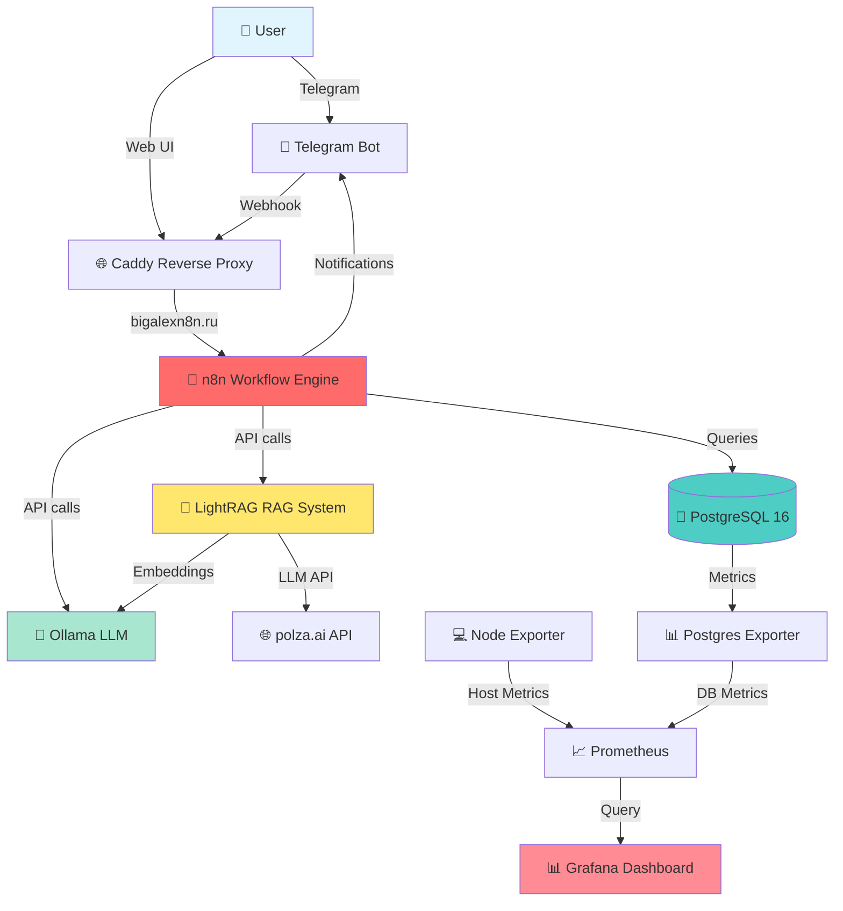

## Layered Architecture

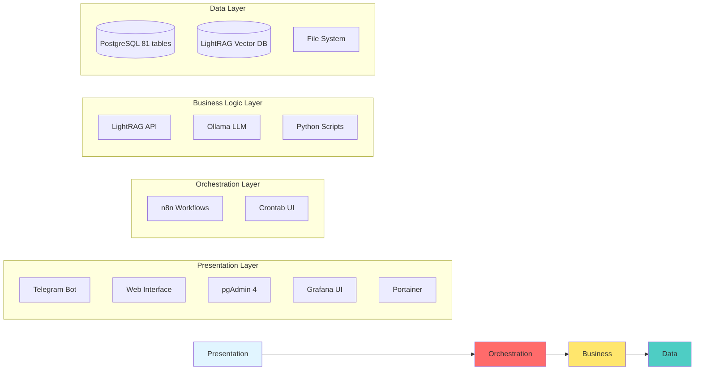

---

# Инфраструктурная диаграмма

## Docker Compose Projects

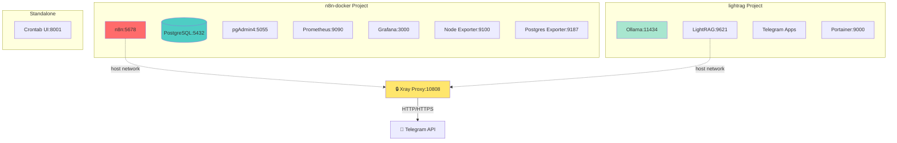

## Resource Allocation

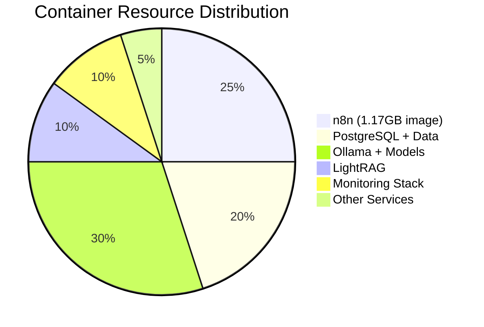

---

# Архитектура Workflows

## Workflow Dependency Graph

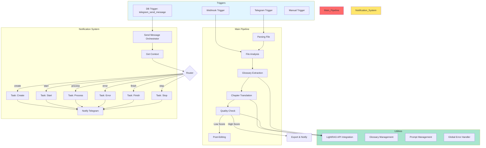

## Notification System Architecture

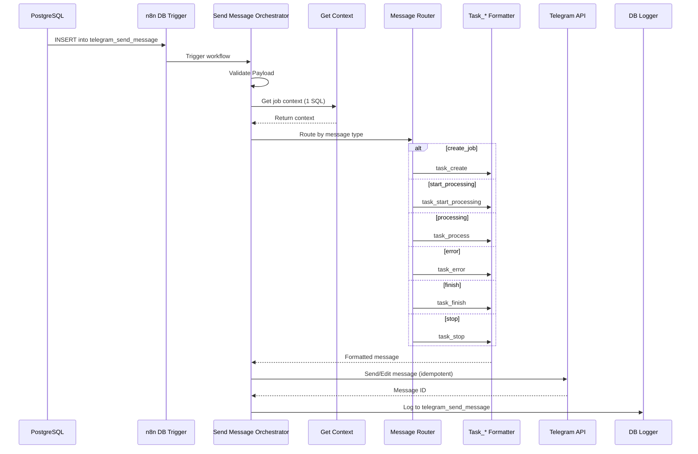

---

# Потоки данных

## Document Translation Flow

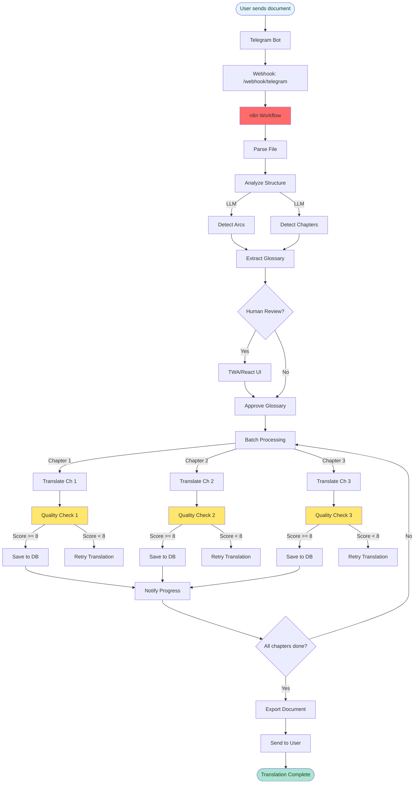

## Notification Flow

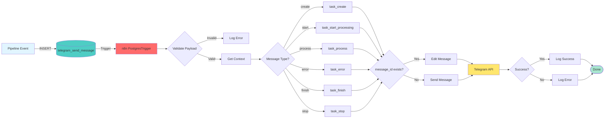

---

# Архитектура базы данных

## Entity Relationship Diagram

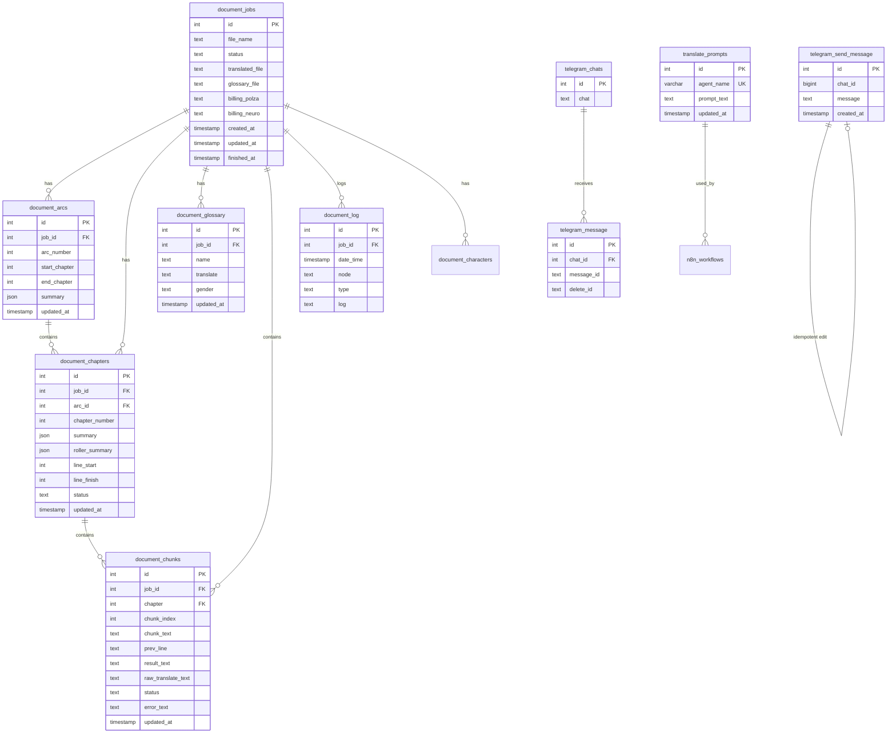

## Table Relationships

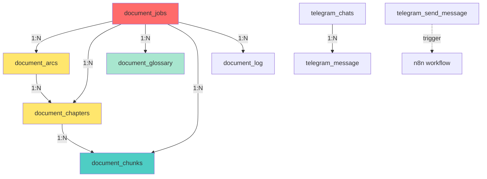

---

# Сетевая архитектура

## Network Topology

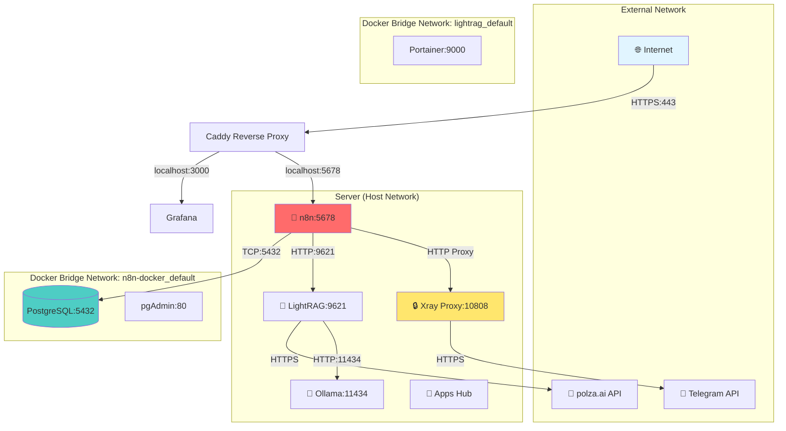

## Reverse Proxy Configuration

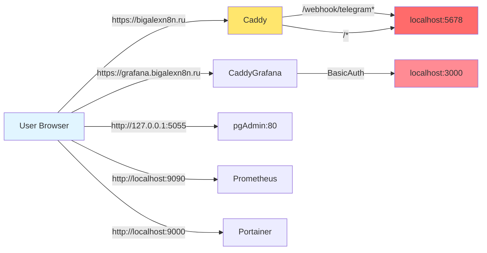

---

# Архитектура мониторинга

## Monitoring Stack

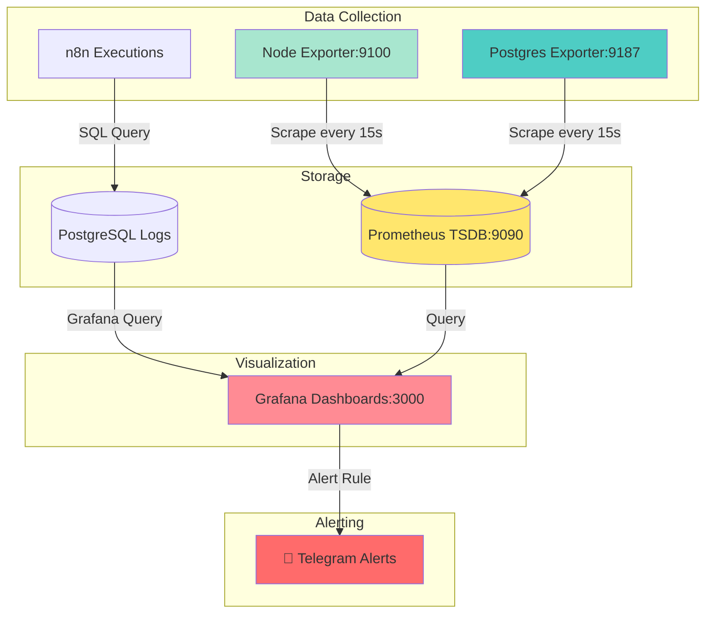

## Grafana Dashboard Structure

```mermaid
graph TB
    Dashboard[n8n Monitoring Dashboard]
    
    Dashboard --> Overview[Overview Row]
    Dashboard --> Executions[Executions Row]
    Dashboard --> Documents[Documents Row]
    Dashboard --> Telegram[Telegram Row]
    Dashboard --> Errors[Errors Row]
    
    Overview --> TotalExec[Total Executions]
    Overview --> SuccessRate[Success Rate]
    Overview --> AvgDuration[Average Duration]
    Overview --> ActiveChats[Active Chats]
    
    Executions --> ExecByStatus[Executions by Status]
    Executions --> ExecByTime[Executions Over Time]
    Executions --> TopErrors[Top Error Workflows]
    
    Documents --> DocByStatus[Documents by Status]
    Documents --> DocOverTime[Documents Over Time]
    Documents --> RecentDocs[Recent Documents Table]
    
    Telegram --> MsgOverTime[Messages Over Time]
    Telegram --> SendErrors[Send Errors]
    
    Errors --> ErrorByComponent[Errors by Component]
    Errors --> RecentErrors[Recent Errors Table]
    
    style Dashboard fill:#ff6b6b
    style Overview fill:#e1f5ff
    style Executions fill:#ffe66d
    style Documents fill:#4ecdc4
    style Telegram fill:#a8e6cf
    style Errors fill:#ff8b94
```

---

# Архитектура безопасности

## Security Layers

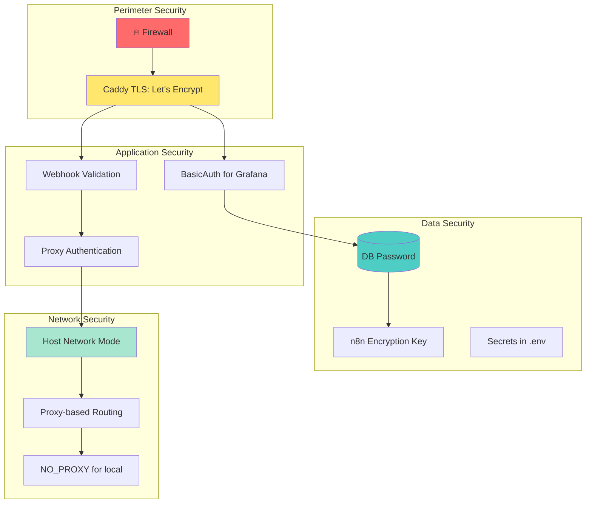

## Access Control

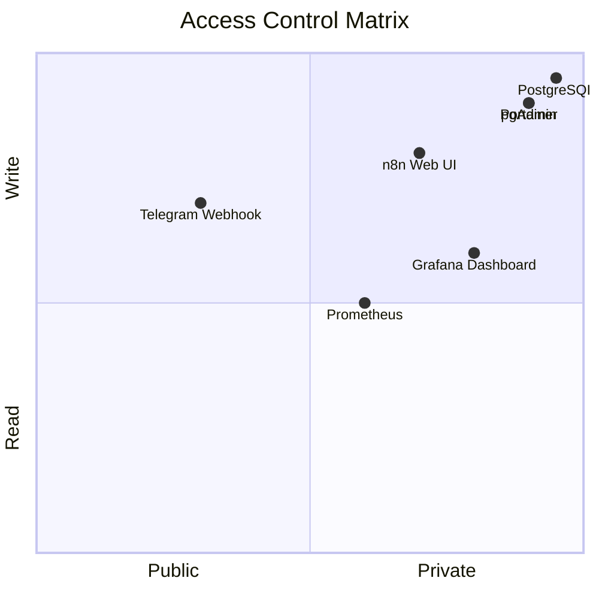

---

**Документация создана:** 9 апреля 2026 г.
**Автор:** AI Architecture Team
**Статус:** На утверждении
