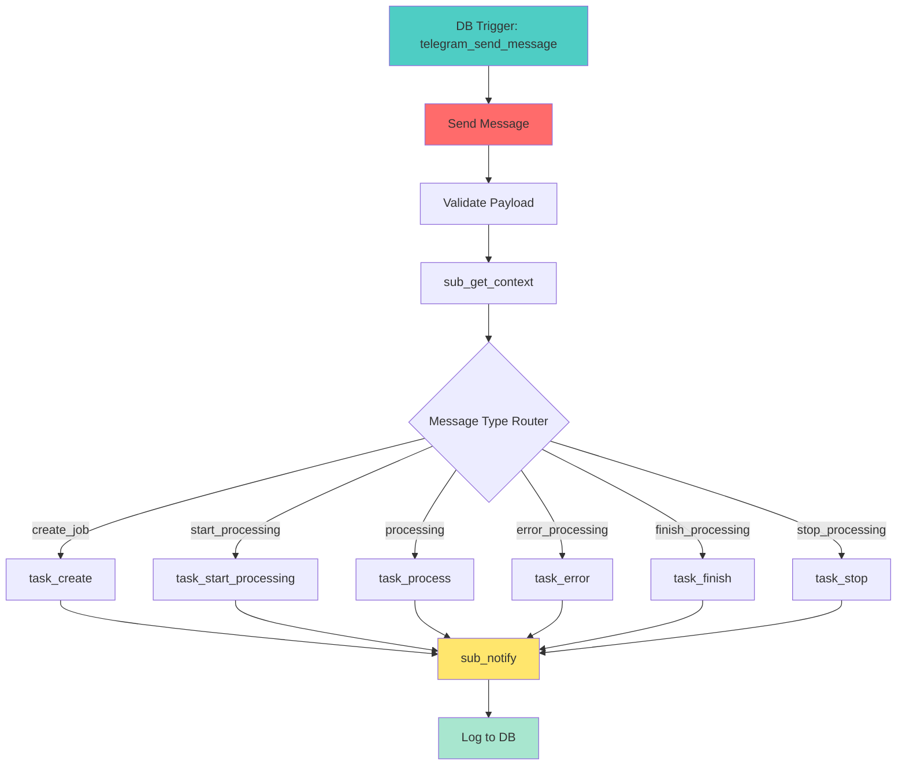

# 🗺️ Карта Workflows n8n Translation System

**Дата:** 9 апреля 2026 г.
**Версия:** 1.0

---

# Содержание

1. [Обзор workflows](#обзор-workflows)
2. [Детальная карта workflows](#детальная-карта-workflows)
3. [Граф зависимостей](#граф-зависимостей)
4. [Матрица активации](#матрица-активации)
5. [Рекомендации по оптимизации](#рекомендации-по-оптимизации)

---

# Обзор workflows

## Статистика

| Категория | Всего | Активных | Неактивных |
|-----------|-------|----------|------------|
| Pipeline Перевода | 8 | 8 | 0 |
| Система уведомлений | 9 | 6 | 3 |
| Task Workflows | 6 | 0 | 6 |
| Telegram Integration | 6 | 3 | 3 |
| Система и утилиты | 7 | 3 | 4 |
| Файлы и ресурсы | 5 | 5 | 0 |
| Управление ресурсами | 6 | 6 | 0 |
| Тестовые и deprecated | 8 | 2 | 6 |
| **ИТОГО** | **55** | **33** | **22** |

---

# Детальная карта workflows

## 1. Pipeline Перевода (8 workflows)

### [Перевод] Арка
- **ID:** В БД
- **Status:** ✅ Active
- **Trigger:** Manual / из Main Pipeline
- **Назначение:** Обработка арки документа (группы глав)
- **Inputs:** arc_id, job_id
- **Outputs:** Arc status, summary
- **Dependencies:** document_arcs, document_chapters
- **Sub-workflows:** [Перевод] Глава

### [Перевод] Глава
- **ID:** В БД
- **Status:** ✅ Active
- **Trigger:** Execute Workflow node
- **Назначение:** Обработка отдельной главы
- **Inputs:** chapter_id, arc_id
- **Outputs:** Chapter status, translation
- **Dependencies:** document_chapters
- **Sub-workflows:** [Перевод] Перевод чанка

### [Перевод] Перевод чанка
- **ID:** В БД
- **Status:** ✅ Active
- **Trigger:** Execute Workflow node
- **Назначение:** Перевод отдельвого чанка текста
- **Inputs:** chunk_id, chunk_text
- **Outputs:** translated_text, status
- **Dependencies:** document_chunks, translate_prompts
- **Integrations:** LightRAG API, Ollama API

### [Перевод] Обработка ошибки
- **ID:** В БД
- **Status:** ✅ Active
- **Trigger:** Error Trigger
- **Назначение:** Error handling для translation errors
- **Inputs:** error_data
- **Outputs:** error_log, retry_decision
- **Dependencies:** document_log

### Парсинг файла для перевода
- **ID:** В БД
- **Status:** ✅ Active
- **Trigger:** Manual / Webhook
- **Назначение:** Initial file parsing (PDF, TXT, etc.)
- **Inputs:** file_path, file_type
- **Outputs:** parsed_text, chapters
- **Dependencies:** document_jobs, document_chunks

### Предварительный анализ файла для перевода
- **ID:** В БД
- **Status:** ✅ Active
- **Trigger:** Manual / после парсинга
- **Назначение:** File structure analysis (arcs, chapters detection)
- **Inputs:** parsed_text
- **Outputs:** structure_data, arcs, chapters
- **Dependencies:** document_arcs, document_chapters
- **Integrations:** LLM for structure detection

### sub_lightrag_api
- **ID:** AW58nseQdLtJn5ZO
- **Status:** ✅ Active
- **Trigger:** Execute Workflow node
- **Назначение:** LightRAG API integration utility
- **Inputs:** query, parameters
- **Outputs:** LightRAG response
- **Integrations:** LightRAG API (port 9621)

### Анотация
- **ID:** 2kztTVutdATd1MDS
- **Status:** ✅ Active
- **Trigger:** Manual / автоматический
- **Назначение:** Generation of chapter/arc summaries
- **Inputs:** chapter_text
- **Outputs:** summary (JSON)
- **Dependencies:** document_chapters.summary
- **Integrations:** Ollama API

---

## 2. Система уведомлений (9 workflows)

### Send Message (Orchestrator)
- **ID:** J62UViXZMD5o6qoU
- **Status:** ✅ Active
- **Trigger:** DB Trigger on telegram_send_message INSERT
- **Назначение:** Main notification orchestrator
- **Inputs:** message payload from DB trigger
- **Outputs:** Telegram notification
- **Dependencies:** telegram_send_message, document_jobs
- **Sub-workflows:** sub_get_context, task_*, sub_notify

### [Send] create_job
- **ID:** В БД
- **Status:** ✅ Active
- **Trigger:** Execute Workflow node
- **Назначение:** Format "job created" message
- **Inputs:** file_name
- **Outputs:** formatted message
- **Message:** 🆕 Задача создана

### [Send] wait
- **ID:** OWLYY2oiQ6YPBJ7M
- **Status:** ✅ Active
- **Trigger:** Execute Workflow node
- **Назначение:** Wait logic between notifications
- **Inputs:** wait_duration
- **Outputs:** delayed execution

### [Send] error
- **ID:** 2uhp8PCTjxiKj91n
- **Status:** ✅ Active
- **Trigger:** Execute Workflow node
- **Назначение:** Format "error" message
- **Inputs:** file_name, error_text
- **Outputs:** formatted error message
- **Message:** ⚠️ Ошибка обработки

### [Send] finish
- **ID:** hoUl3ewz23AwAHlq
- **Status:** ✅ Active
- **Trigger:** Execute Workflow node
- **Назначение:** Format "completion" message
- **Inputs:** file_name, translated_file, billing
- **Outputs:** formatted completion message
- **Message:** ✅ Перевод завершен!

### [Send] processing
- **ID:** 9uUyj9OamISRPudJ
- **Status:** ✅ Active
- **Trigger:** Execute Workflow node
- **Назначение:** Format "progress" message
- **Inputs:** file_name, chunks_done, chunks_total, billing
- **Outputs:** formatted progress message (with progress bar)
- **Message:** 🔄 Перевод в процессе

### sub_get_context
- **ID:** sub_get_context
- **Status:** ❌ Inactive (но используется Send Message)
- **Trigger:** Execute Workflow node
- **Назначение:** Get job context (1 optimized SQL query)
- **Inputs:** job_id (optional)
- **Outputs:** job context (file_name, billing, chunks, etc.)
- **Dependencies:** document_jobs, document_chunks, job_current
- **SQL:** 1 query вместо 3 (оптимизировано)

### sub_notify
- **ID:** sub_notify
- **Status:** ❌ Inactive (но используется Send Message)
- **Trigger:** Execute Workflow node
- **Назначение:** Send/Edit Telegram messages (idempotent)
- **Inputs:** message, type, button, message_id
- **Outputs:** Telegram API response
- **Features:** Idempotency (Edit vs Send), error handling

### Select From List
- **ID:** В БД
- **Status:** ✅ Active
- **Trigger:** Manual / Telegram callback
- **Назначение:** Interactive file selection
- **Inputs:** callback_data
- **Outputs:** selected file
- **Dependencies:** telegram_chats

---

## 3. Task Workflows (6 workflows - Message Formatters)

> **Примечание:** Эти workflows неактивны, но вызываются через Execute Workflow node

### SM - Task - Create
- **ID:** task_create
- **Status:** ❌ Inactive
- **Назначение:** Format "create" message
- **Inputs:** file_name
- **Outputs:** {message, type: 'create'}

### SM - Task - Start Processing
- **ID:** 045b5efb-798e-4cae-bc86-c57ed9534596
- **Status:** ❌ Inactive
- **Назначение:** Format "start" message with 0% progress
- **Inputs:** file_name, chunks_total
- **Outputs:** {message, type: 'start'}

### SM - Task - Process
- **ID:** task_process
- **Status:** ❌ Inactive
- **Назначение:** Format "process" message with progress bar
- **Inputs:** file_name, chunks_done, chunks_total, billing
- **Outputs:** {message, type: 'process'}

### SM - Task - Error
- **ID:** 0f492540-d004-445a-b039-9408900af643
- **Status:** ❌ Inactive
- **Назначение:** Format "error" message
- **Inputs:** file_name, error_text
- **Outputs:** {message, type: 'error'}

### SM - Task - Finish
- **ID:** task_finish
- **Status:** ❌ Inactive
- **Назначение:** Format "finish" message with results
- **Inputs:** file_name, translated_file, billing
- **Outputs:** {message, type: 'finish'}

### SM - Task - Stop
- **ID:** 5926c044-e633-4877-97aa-a73cbc5658ce
- **Status:** ❌ Inactive
- **Назначение:** Format "stop" message with button
- **Inputs:** file_name
- **Outputs:** {message, type: 'stop', button}

---

## 4. Telegram Integration (6 workflows)

### Telegram Trigger
- **ID:** telegram-trigger
- **Status:** ❌ Inactive (возможно используется DB trigger)
- **Trigger:** Telegram Bot (message updates)
- **Назначение:** Main Telegram message reception
- **Inputs:** Telegram message object
- **Outputs:** routed message
- **Features:** Duplicate check, message type routing

### Перезапуск прослушки Telegram
- **ID:** В БД
- **Status:** ✅ Active
- **Trigger:** Manual / Schedule
- **Назначение:** Restart Telegram listener
- **Use case:** При проблемах с подключением

### Получение сообщения
- **ID:** В БД
- **Status:** ✅ Active
- **Trigger:** Manual / после Telegram Trigger
- **Назначение:** Message processing and storage
- **Inputs:** Telegram message
- **Outputs:** stored message
- **Dependencies:** telegram_messages

### Telegram Final
- **ID:** В БД
- **Status:** ❌ Inactive
- **Назначение:** Final telegram processing logic
- **Possible:** cleanup, logging

### Telegram Simple
- **ID:** В БД
- **Status:** ❌ Inactive
- **Назначение:** Simple telegram test/echo
- **Use case:** Testing

### Telegram Webhook Handler
- **ID:** В БД
- **Status:** ❌ Inactive
- **Trigger:** Webhook /webhook/telegram
- **Назначение:** Alternative webhook handler
- **Possible:** backup/legacy

### 🔄 Telegram Polling (n8n)
- **ID:** В БД
- **Status:** ❌ Inactive
- **Trigger:** Schedule (polling)
- **Назначение:** Polling-based message reception (alternative to webhook)
- **Use case:** Если webhook не работает

---

## 5. Система и утилиты (7 workflows)

### 🔴 Global Error Handler
- **ID:** global-error-handler-0vh7sstt4fc1wugw
- **Status:** ✅ Active
- **Trigger:** Error Trigger (global)
- **Назначение:** Global error handling для всех workflows
- **Inputs:** error event
- **Outputs:** error log, notification
- **Features:** Centralized error processing

### System - Stats Dashboard
- **ID:** pmfooV949S1weDwV
- **Status:** ❌ Inactive
- **Trigger:** Manual / Schedule
- **Назначение:** Analytics dashboard data generation
- **Outputs:** statistics
- **Integrations:** Grafana

### System - Proxy Check
- **ID:** tJg2AYCjlBnOb3eO
- **Status:** ❌ Inactive
- **Trigger:** Manual / Schedule
- **Назначение:** Proxy connectivity monitoring
- **Outputs:** proxy status
- **Use case:** Troubleshooting

### System - Novel Pipeline Test
- **ID:** system_pipeline_test.json
- **Status:** ❌ Inactive
- **Trigger:** Manual
- **Назначение:** Pipeline integrity testing
- **Use case:** Validation after changes

### Start
- **ID:** В БД
- **Status:** ✅ Active
- **Trigger:** Manual / initialization
- **Назначение:** System initialization workflow
- **Use case:** Setup, migration

### Finish
- **ID:** В БД
- **Status:** ✅ Active
- **Trigger:** Manual / completion
- **Назначение:** Completion logic, cleanup
- **Use case:** Finalization

### Translate Chunk
- **ID:** В БД
- **Status:** ✅ Active
- **Trigger:** Execute Workflow node
- **Назначение:** Utility для перевода чанка
- **Inputs:** chunk_text
- **Outputs:** translated_text
- **Integrations:** LightRAG, Ollama

---

## 6. Файлы и ресурсы (5 workflows)

### [GET] /select_files
- **ID:** В БД
- **Status:** ✅ Active
- **Trigger:** Webhook GET /select_files
- **Назначение:** File selection endpoint
- **Outputs:** list of available files

### [GET] Document
- **ID:** В БД
- **Status:** ✅ Active
- **Trigger:** Webhook GET /document
- **Назначение:** Document retrieval
- **Inputs:** document_id
- **Outputs:** document data

### [Send] create_job
- **ID:** В БД
- **Status:** ✅ Active
- **Trigger:** Webhook / Manual
- **Назначение:** Job creation entry point
- **Inputs:** file info
- **Outputs:** job_id
- **Dependencies:** document_jobs

### Переведенный файл в Telegram
- **ID:** sv73wrV6anQE7cTv
- **Status:** ✅ Active
- **Trigger:** Manual / после completion
- **Назначение:** Send translated file to Telegram
- **Inputs:** translated_file_path, chat_id
- **Outputs:** Telegram message with file

### Переведенный файл в Google Drive
- **ID:** KebWQcS1WmNtgdgA
- **Status:** ✅ Active
- **Trigger:** Manual / после completion
- **Назначение:** Backup to Google Drive
- **Inputs:** translated_file_path
- **Outputs:** Google Drive link

---

## 7. Управление ресурсами (6 workflows)

### Добавление Глоссария
- **ID:** В БД
- **Status:** ✅ Active
- **Trigger:** Manual / автоматический
- **Назначение:** Glossary term management
- **Inputs:** term, translation
- **Outputs:** glossary entry
- **Dependencies:** document_glossary

### Создание Глоссария
- **ID:** В БД
- **Status:** ✅ Active
- **Trigger:** Manual / из Pipeline
- **Назначение:** Initial glossary creation
- **Inputs:** document text
- **Outputs:** glossary terms
- **Integrations:** LightRAG, Ollama

### Добавление Промта
- **ID:** В БД
- **Status:** ✅ Active
- **Trigger:** Manual
- **Назначение:** Prompt management
- **Inputs:** agent_name, prompt_text
- **Outputs:** prompt entry
- **Dependencies:** translate_prompts

### Добавление промта для постредакта
- **ID:** FuVQL0O5ik3aocbx
- **Status:** ✅ Active
- **Trigger:** Manual
- **Назначение:** Post-editing prompts
- **Inputs:** prompt_text
- **Outputs:** prompt entry

### Добавление ресурсов в бд
- **ID:** rlk5lgq3uE4N0yl0
- **Status:** ✅ Active
- **Trigger:** Manual
- **Назначение:** General resource DB management
- **Inputs:** resource data
- **Outputs:** DB records

### Настройка БД
- **ID:** В БД
- **Status:** ✅ Active
- **Trigger:** Manual / initialization
- **Назначение:** Database initialization
- **Use case:** Setup, migration

---

## 8. Тестовые и deprecated (8 workflows)

### Activate All Workflows (Mass)
- **ID:** EOxIC1gGDuZXeAK4
- **Status:** ❌ Inactive
- **Trigger:** Manual
- **Назначение:** Mass activation utility
- **Use case:**批量激活 workflows

### Test Webhook Trigger
- **ID:** rKTWa4ZzlQ2xepEH
- **Status:** ❌ Inactive
- **Trigger:** Webhook
- **Назначение:** Webhook testing
- **Use case:** Development

### [TEST] Error Handler Check
- **ID:** В БД
- **Status:** ❌ Inactive
- **Trigger:** Manual
- **Назначение:** Error handler testing
- **Use case:** Testing

### [TEST] Manual Error Test
- **ID:** В БД
- **Status:** ❌ Inactive
- **Trigger:** Manual
- **Назначение:** Manual error simulation
- **Use case:** Testing

### Test Minimal Webhook
- **ID:** В БД
- **Status:** ❌ Inactive
- **Trigger:** Webhook
- **Назначение:** Minimal webhook test
- **Use case:** Development

### My workflow
- **ID:** В БД
- **Status:** ❌ Inactive
- **Назначение:** Default/unused
- **Action:** 🗑️ Можно удалить

### [depricated] Send Message (RESTORED)
- **ID:** В БД
- **Status:** ❌ Inactive
- **Назначение:** Old version of Send Message
- **Action:** 🗑️ Можно удалить (заменен новым)

### SM - Task Workflows (старые версии)
- **IDs:** a36f25d0, 8eb0dc61, 01ccb964, 46ff39dd, и др.
- **Status:** ❌ Inactive
- **Назначение:** Old task workflow versions
- **Action:** 🗑️ Можно удалить (заменены новыми)

---

# Граф зависимостей

## Main Dependency Graph

```mermaid
graph TB
    subgraph "Entry Points"
        TG[Telegram Trigger]
        WH[Webhook Triggers]
        DB[DB Triggers]
        MAN[Manual Triggers]
    end
    
    subgraph "Main Pipeline"
        Parse[Парсинг файла]
        Analysis[Предварительный анализ]
        Arcs[[Перевод] Арка]
        Chapters[[Перевод] Глава]
        Chunks[[Перевод] Перевод чанка]
        ErrHandle[[Перевод] Обработка ошибки]
    end
    
    subgraph "Notification System"
        SendMsg[Send Message]
        Context[sub_get_context]
        Tasks[Task_* Formatters]
        Notify[sub_notify]
    end
    
    subgraph "Utilities"
        LightragAPI[sub_lightrag_api]
        Glossary[Добавление/Создание Глоссария]
        Prompts[Добавление Промта]
        Annotate[Анотация]
        TranslateChunk[Translate Chunk]
    end
    
    subgraph "Output"
        ToTG[Переведенный файл в Telegram]
        ToGD[Переведенный файл в Google Drive]
    end
    
    TG --> Parse
    WH --> Analysis
    DB --> SendMsg
    
    Parse --> Analysis
    Analysis --> Arcs
    Arcs --> Chapters
    Chapters --> Chunks
    
    Chunks --> LightragAPI
    Chunks --> TranslateChunk
    
    Chunks -->|Error| ErrHandle
    
    SendMsg --> Context
    Context --> Tasks
    Tasks --> Notify
    Notify --> ToTG
    
    Chapters --> Glossary
    Chapters --> Prompts
    Chapters --> Annotate
    
    Chapters -->|Complete| ToTG
    Chapters -->|Complete| ToGD
    
    style Entry_Points fill:#e1f5ff
    style Main_Pipeline fill:#ff6b6b
    style Notification_System fill:#ffe66d
    style Utilities fill:#a8e6cf
    style Output fill:#4ecdc4
```

## Call Graph: Send Message



---

# Матрица активации

## Active Workflows (33)

| # | Workflow Name | Category | Dependencies |
|---|---------------|----------|--------------|
| 1 | [Перевод] Арка | Pipeline | document_arcs |
| 2 | [Перевод] Глава | Pipeline | document_chapters |
| 3 | [Перевод] Перевод чанка | Pipeline | document_chunks |
| 4 | [Перевод] Обработка ошибки | Pipeline | document_log |
| 5 | Парсинг файла для перевода | Pipeline | document_jobs |
| 6 | Предварительный анализ файла для перевода | Pipeline | document_arcs |
| 7 | sub_lightrag_api | Pipeline | LightRAG API |
| 8 | Анотация | Pipeline | document_chapters |
| 9 | Send Message | Notifications | telegram_send_message |
| 10 | [Send] create_job | Notifications | - |
| 11 | [Send] wait | Notifications | - |
| 12 | [Send] error | Notifications | - |
| 13 | [Send] finish | Notifications | - |
| 14 | [Send] processing | Notifications | - |
| 15 | Select From List | Notifications | telegram_chats |
| 16 | Перезапуск прослушки Telegram | Telegram | - |
| 17 | Получение сообщения | Telegram | telegram_messages |
| 18 | Start | System | - |
| 19 | Finish | System | - |
| 20 | Translate Chunk | System | LightRAG |
| 21 | 🔴 Global Error Handler | System | - |
| 22 | [GET] /select_files | Files | - |
| 23 | [GET] Document | Files | document_jobs |
| 24 | [Send] create_job | Files | document_jobs |
| 25 | Переведенный файл в Telegram | Files | - |
| 26 | Переведенный файл в Google Drive | Files | - |
| 27 | Добавление Глоссария | Resources | document_glossary |
| 28 | Создание Глоссария | Resources | - |
| 29 | Добавление Промта | Resources | translate_prompts |
| 30 | Добавление промта для постредакта | Resources | translate_prompts |
| 31 | Добавление ресурсов в бд | Resources | - |
| 32 | Настройка БД | Resources | - |
| 33 | Postредактура | Pipeline | - |

## Inactive Workflows (22)

| # | Workflow Name | Category | Action |
|---|---------------|----------|--------|
| 1 | Activate All Workflows (Mass) | Utility | 🗑️ Archive |
| 2 | sub_get_context | Notifications | ⚠️ Check usage |
| 3 | sub_notify | Notifications | ⚠️ Check usage |
| 4 | SM - Task - Create | Task | ✅ Used via Execute node |
| 5 | SM - Task - Start Processing | Task | ✅ Used via Execute node |
| 6 | SM - Task - Process | Task | ✅ Used via Execute node |
| 7 | SM - Task - Error | Task | ✅ Used via Execute node |
| 8 | SM - Task - Finish | Task | ✅ Used via Execute node |
| 9 | SM - Task - Stop | Task | ✅ Used via Execute node |
| 10 | Telegram Trigger | Telegram | ⚠️ Check if needed |
| 11 | Telegram Final | Telegram | 🗑️ Archive |
| 12 | Telegram Simple | Telegram | 🗑️ Archive |
| 13 | Telegram Webhook Handler | Telegram | 🗑️ Archive |
| 14 | 🔄 Telegram Polling (n8n) | Telegram | 🗑️ Archive |
| 15 | System - Stats Dashboard | System | 🔧 Activate |
| 16 | System - Proxy Check | System | 🔧 Activate |
| 17 | System - Novel Pipeline Test | System | 🔧 Activate |
| 18 | Test Webhook Trigger | Test | 🗑️ Archive |
| 19 | [TEST] Error Handler Check | Test | 🗑️ Archive |
| 20 | [TEST] Manual Error Test | Test | 🗑️ Archive |
| 21 | Test Minimal Webhook | Test | 🗑️ Archive |
| 22 | My workflow | Default | 🗑️ Delete |
| 23 | [depricated] Send Message (RESTORED) | Deprecated | 🗑️ Delete |

**Legend:**
- 🗑️ - Можно удалить/архивировать
- ⚠️ - Проверить использование
- ✅ - Используется через Execute Workflow node (active не требуется)
- 🔧 - Рекомендуется активировать

---

# Рекомендации по оптимизации

## 1. Immediate Actions (Priority: HIGH)

### Удалить/архивировать deprecated workflows
```sql
-- Archive old workflows
UPDATE workflow_entity 
SET "isArchived" = true 
WHERE name IN (
    'My workflow',
    '[depricated] Send Message (RESTORED)',
    'Telegram Final',
    'Telegram Simple',
    'Telegram Webhook Handler',
    '🔄 Telegram Polling (n8n)',
    'Test Webhook Trigger',
    '[TEST] Error Handler Check',
    '[TEST] Manual Error Test',
    'Test Minimal Webhook'
);
```

### Активировать системные workflows
- System - Stats Dashboard (для мониторинга)
- System - Proxy Check (для troubleshooting)
- System - Novel Pipeline Test (для validation)

## 2. Short-term Improvements (Priority: MEDIUM)

### Consolidate Task Workflows
- Объединить 6 task_* workflows в 1 с параметризацией
- Уменьшит дублирование кода
- Упростит поддержку

### Standardize Naming
```
[Current]
- [Перевод] Арка
- Парсинг файла для перевода
- sub_lightrag_api

[Proposed]
- [Pipeline] Arc Processing
- [Pipeline] File Parsing
- [Integration] LightRAG API
```

### Add Workflow Descriptions
- Все workflows должны иметь description поле
- Документировать inputs/outputs
- Указать зависимости

## 3. Long-term Architecture (Priority: LOW)

### Workflow Versioning
- Использовать Git sync (уже настроен)
- Версионировать изменения
- Rollback capability

### Workflow Testing Framework
- Unit tests для task_* workflows
- Integration tests для pipeline
- Automated testing on changes

### Performance Optimization
- Parallel chapter translation (batch=3)
- Caching для повторяющихся запросов
- Connection pooling для БД

---

**Документация создана:** 9 апреля 2026 г.
**Автор:** AI Architecture Team
**Статус:** На утверждении
